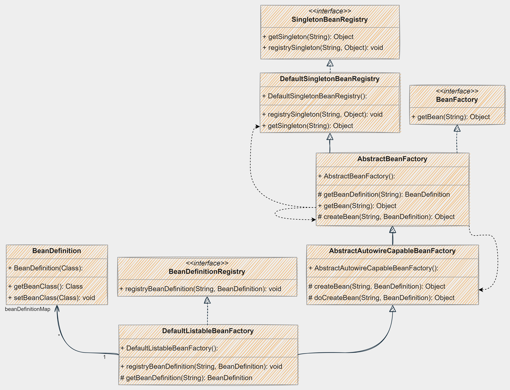
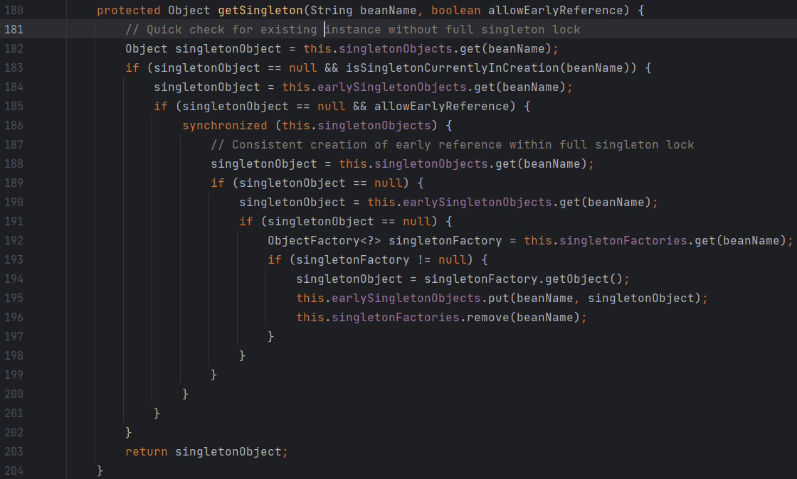
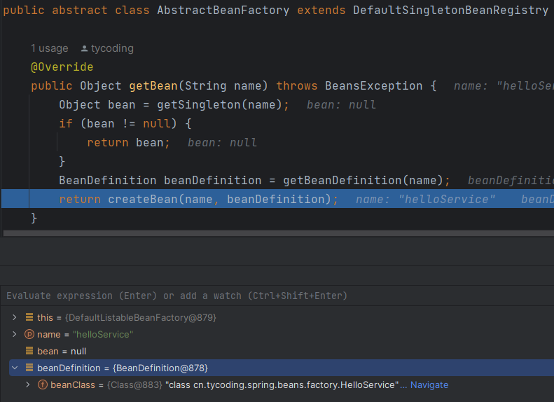
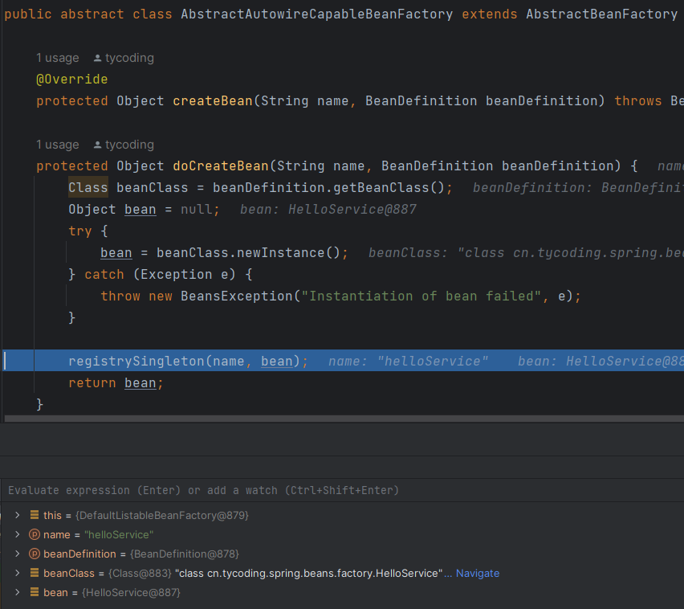
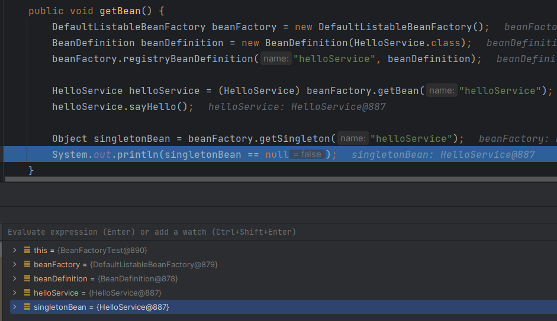

# BeanFactory和BeanDefinition基础实现

> 当前文档对应Git分支：`01-BeanFactory`




## SingleBeanRegistry<interface>

Bean容器的操作接口，定义操作Bean容器的方法。

## DefaultSingletonBeanRegistry

`SingleBeanRegistry` 接口实现类（操作Bean容器）；
Bean容器实际是一个 `Map<String, Object>` 对象，`DefaultSingletonBeanRegistry` 主要负责对Bean的操作
（也就是对Map对象的put和remove操作）。

在Spring的源码中，此对象的 `getSingleton()` 方法（从Map容器中get一个bean）涉及了三级缓存操作（Spring解决循环依赖）。



## BeanDefinitionRegistry<interface>

`BeanDefinition` 包含了Bean实例的信息，包括Class、Method信息等；

`BeanDefinitionRegistry` 接口定义了操作 `BeanDefinition` 接口方法，

## DefaultListableBeanFactory

`BeanDefinitionRegistry` 接口实现类，负责对 `beanDefinitionMap` 的put和remove操作；

在Spring中 `DefaultListableBeanFactory` 负责了Bean完成的初始化操作，经过这里初始化后的Bean最终再写入BeanMap容器中

## BeanFactory<interface>

Bean工厂接口，定义Bean操作的基础接口方法。

## AbstractBeanFactory

BeanFactory的实现类，对BeanFactory接口中的方法做具体实现。

### getBean()

以下是此版本中的简易代码实现：

```java
@Override
public Object getBean(String name) throws BeansException {
    Object bean = getSingleton(name);
    if (bean != null) {
        return bean;
    }
    BeanDefinition beanDefinition = getBeanDefinition(name);
    return createBean(name, beanDefinition);
}
```

1. 首先从`DefaultSingletonBeanRegistry`的beanMap容器中拿到Bean单例对象，如果存在就直接返回；
2. 如果beanMap容器中没有此Bean，先在 `DefaultListableBeanFactory` 中完成Bean初始化操作；
3. 拿到初始化后的BeanDefinition对象再调用 `AbstractBeanFactory` 的抽象方法 `createBean` 创建Bean；

### createBean() 

此抽象方法由抽象类 `AbstractAutowireCapableBeanFactory` 做具体实现（模板模式）；

### getBeanDefinition()

此抽象方法由抽象类 `DefaultListableBeanFactory` 做具体实现（模板模式）；

## AbstractAutowireCapableBeanFactory

`AbstractBeanFactory` 接口实现类，负责Bean的创建操作，创建后的Bean将写入到BeanMap容器中；以下是此版本的简易代码实现：

```java
protected Object doCreateBean(String name, BeanDefinition beanDefinition) {
    Class beanClass = beanDefinition.getBeanClass();
    Object bean = null;
    try {
        bean = beanClass.newInstance();
    } catch (Exception e) {
        throw new BeansException("Instantiation of bean failed", e);
    }

    registrySingleton(name, bean);
    return bean;
}
```


2. 写入到单例BeanMap容器中；

# Test

测试代码如下：

```java
@Test
public void getBean() {
    DefaultListableBeanFactory beanFactory = new DefaultListableBeanFactory();
    BeanDefinition beanDefinition = new BeanDefinition(HelloService.class);
    beanFactory.registryBeanDefinition("helloService", beanDefinition);

    HelloService helloService = (HelloService) beanFactory.getBean("helloService");
    helloService.sayHello();

    Object singletonBean = beanFactory.getSingleton("helloService");
    System.out.println(singletonBean == null);
}
```

1. 通过 `DefaultListableBeanFactory` 初始化 `BeanDefinition` 容器；



2. 调用 `getBean()` 判断BeanMap中没有初始化此Bean，因此通过 `BeanDefinition` 对象调用 `newInstance()` 初始化；
3. `newInstance()` 初始化后再写入BeanMap



4. 完成Bean初始化后，再次从BeanMap容器get，发现可以直接拿到了Bean对象




