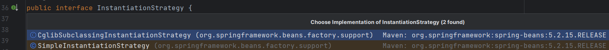
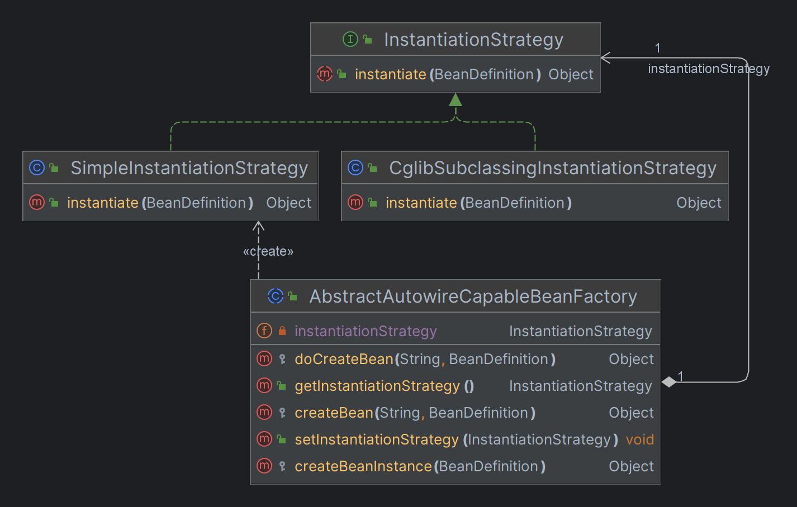

# Bean实例化策略

> 当前文档对应Git分支：`02-BeanInstanceStrategy`

在上一个分支 [01-BeanFactory](../01-BeanFactory/README.md) 中 `AbstractAutowireCapableBeanFactory` 对象负责Bean的创建操作，
当时采用了 `Class.newInstance()` 方法进行Bean实例化创建。

而在Spring源码中，Bean实例化策略接口 `InstantiationStrategy` 对应了两个实现类：

1. `SimpleInstantiationStrategy` 简单Bean实例方法，包含了使用Bean工厂实例化（反射）、使用构造函数实例化Bean；
2. `CglibSubclassingInstantiationStrategy` 使用Cglib实例化Bean，这是Spring默认的方式；



当前分支Bean实例化仅模拟了 `SimpleInstantiationStrategy` 的使用构造函函数实例化Bean，代码如下：

```java
@Override
public Object instantiate(BeanDefinition beanDefinition) throws BeansException {
    Class clazz = beanDefinition.getBeanClass();
    try {
        Constructor constructor = clazz.getDeclaredConstructor();
        return constructor.newInstance();
    } catch (Exception e) {
        throw new BeansException("Failed to instantiate [" + clazz.getName() + "]", e);
    }
}
```



