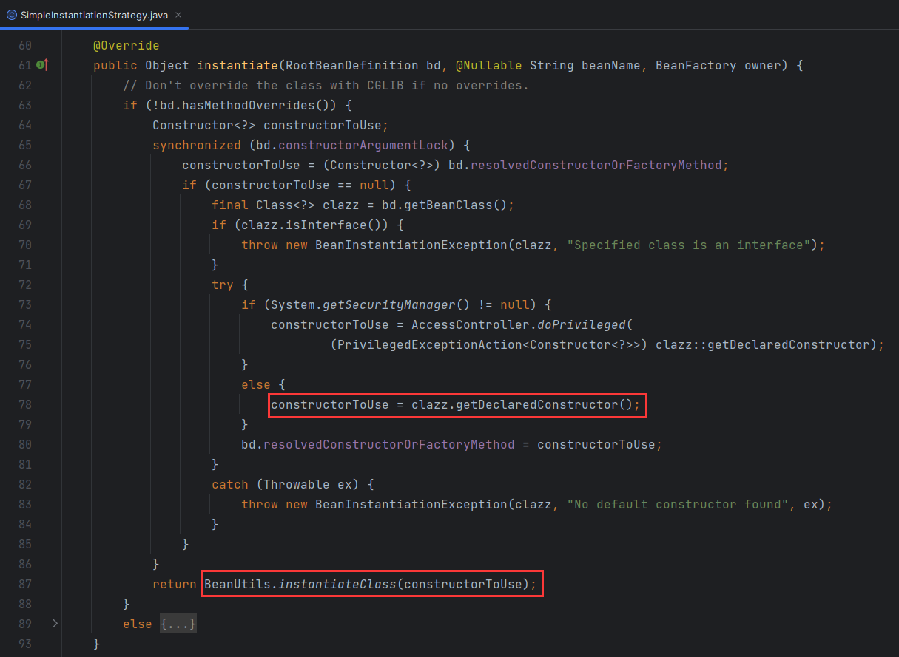
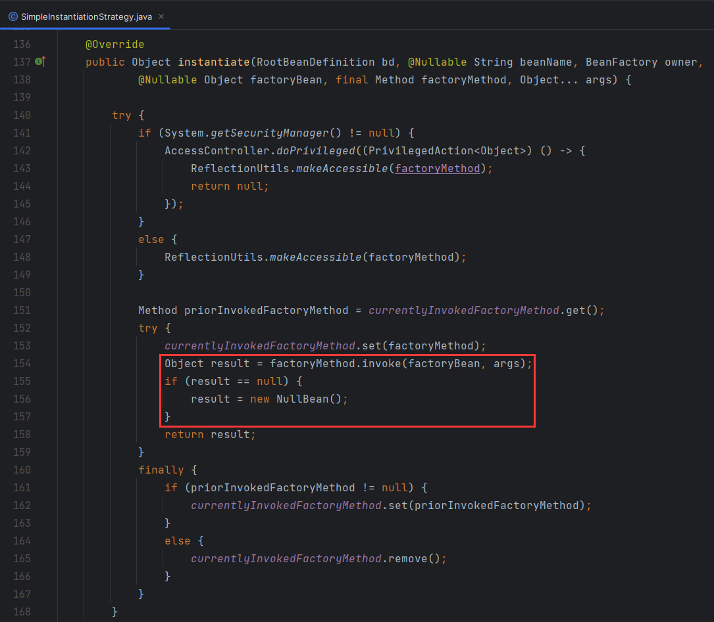

# Bean实例化策略

> 当前文档对应Git分支：`02-bean-instance-strategy`

在上一个分支 [01-bean-factory](../01-bean-factory/README.md) 中 `AbstractAutowireCapableBeanFactory` 对象负责Bean的创建操作，
当时采用了 `Class.newInstance()` 方法进行Bean实例化创建。

而在Spring源码中，Bean实例化策略接口 `InstantiationStrategy` 对应了两个实现类：

1. `SimpleInstantiationStrategy` 简单Bean实例方法，包含了使用Bean工厂实例化（反射）、使用构造函数实例化Bean；
2. `CglibSubclassingInstantiationStrategy` 使用Cglib实例化Bean，这是Spring默认的方式；


## SimpleInstantiationStrategy

在Spring源码中，`SimpleInstantiationStrategy` 提供了几种简单的实例化Bean的方式，例如使用：构造函数（有参/无参）、BeanFactory（利用反射）；

本例中，模拟了无参构造函数实例化Bean的方式，代码如下：

```java
@Override
public Object instantiate(BeanDefinition beanDefinition) throws BeansException {
    Class clazz = beanDefinition.getBeanClass();
    try {
        // 这里直接使用无参构造实例化
        Constructor constructor = clazz.getDeclaredConstructor();
        return constructor.newInstance();
    } catch (Exception e) {
        throw new BeansException("Failed to instantiate [" + clazz.getName() + "]", e);
    }
}
```

那么再看Spring源码中 `SimpleInstantiationStrategy` 如何实现的：






# 扩展

## 几种Bean实例化方式

```java
public class BeanInstanceTest {

    /**
     * 无参构造函数实例化Bean
     */
    @Test
    public void t1() throws InstantiationException, IllegalAccessException {
        BeanInstanceClazz instance = BeanInstanceClazz.class.newInstance();
        System.out.println(instance);
    }

    /**
     * 有参构造函数实例化Bean
     */
    @Test
    public void t2() throws NoSuchMethodException, InvocationTargetException, InstantiationException,
            IllegalAccessException {
        Class<BeanInstanceClazz> clazz = BeanInstanceClazz.class;
        Constructor<BeanInstanceClazz> constructor = clazz.getDeclaredConstructor(String.class);
        BeanInstanceClazz instance = constructor.newInstance("tycoding");
        System.out.println(instance.getName());
    }

    @Test
    public void t3() {
        Enhancer enhancer = new Enhancer();
        enhancer.setSuperclass(BeanInstanceClazz.class);
        enhancer.setCallback((MethodInterceptor) (obj, method, args, proxy) -> proxy.invokeSuper(obj, args));
        Object instance = enhancer.create();
        System.out.println(instance);
    }
}

class BeanInstanceClazz {
    private String name;

    public BeanInstanceClazz() {
    }

    public BeanInstanceClazz(String name) {
        this.name = name;
    }

    public String getName() {
        return name;
    }
}
```

## JDK动态代理

## Cglib动态代理
