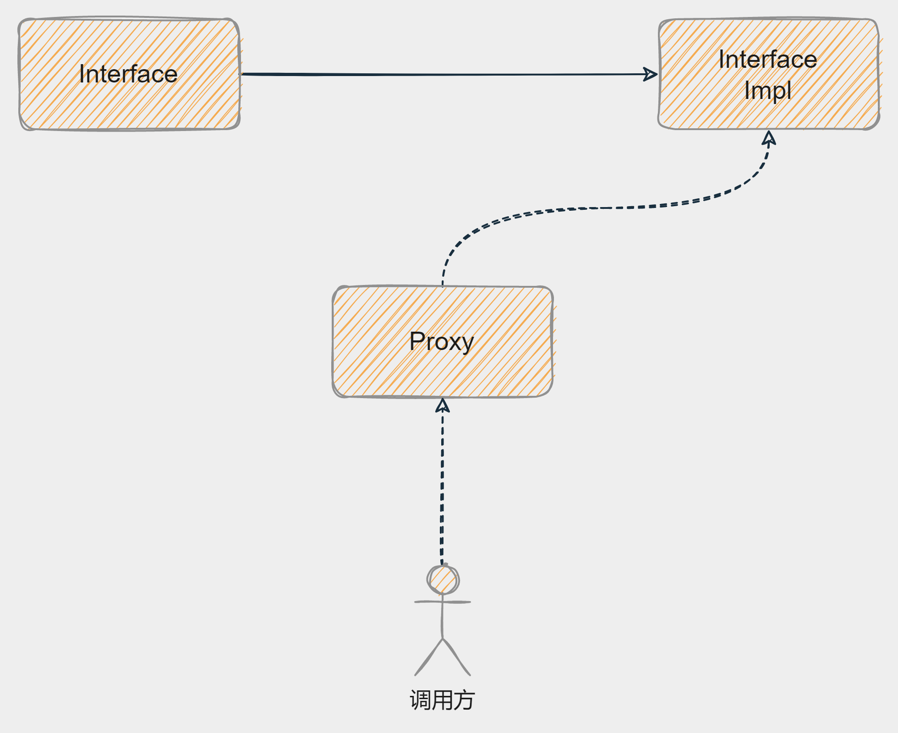

# Bean实例化策略

> 当前文档对应Git分支：`02-bean-instance-strategy`

在上一个分支 [01-bean-factory](../01-bean-factory/README.md) 中 `AbstractAutowireCapableBeanFactory` 对象负责Bean的创建操作，
当时采用了 `Class.newInstance()` 方法进行Bean实例化创建。

而在Spring源码中，Bean实例化策略接口 `InstantiationStrategy` 对应了两个实现类：

1. `SimpleInstantiationStrategy` 简单Bean实例方法，包含了使用Bean工厂实例化（反射）、使用构造函数实例化Bean；
2. `CglibSubclassingInstantiationStrategy` 使用Cglib实例化Bean，这是Spring默认的方式；


## SimpleInstantiationStrategy

在Spring源码中，`SimpleInstantiationStrategy` 提供了几种简单的实例化Bean的方式，例如使用：构造函数（有参/无参）、BeanFactory（利用反射）；

本例中，模拟了无参构造函数实例化Bean的方式，代码如下：

```java
@Override
public Object instantiate(BeanDefinition beanDefinition) throws BeansException {
    Class clazz = beanDefinition.getBeanClass();
    try {
        // 这里直接使用无参构造实例化
        Constructor constructor = clazz.getDeclaredConstructor();
        return constructor.newInstance();
    } catch (Exception e) {
        throw new BeansException("Failed to instantiate [" + clazz.getName() + "]", e);
    }
}
```

那么再看Spring源码中 `SimpleInstantiationStrategy` 如何实现的：


## 几种Bean实例化方式

```java
public class BeanInstanceTest {

    /**
     * 无参构造函数实例化Bean
     */
    @Test
    public void t1() throws InstantiationException, IllegalAccessException {
        BeanInstanceClazz instance = BeanInstanceClazz.class.newInstance();
        System.out.println(instance);
    }

    /**
     * 有参构造函数实例化Bean
     */
    @Test
    public void t2() throws NoSuchMethodException, InvocationTargetException, InstantiationException,
            IllegalAccessException {
        Class<BeanInstanceClazz> clazz = BeanInstanceClazz.class;
        Constructor<BeanInstanceClazz> constructor = clazz.getDeclaredConstructor(String.class);
        BeanInstanceClazz instance = constructor.newInstance("tycoding");
        System.out.println(instance.getName());
    }

    /**
     * 使用Cglib实例化Bean
     */
    @Test
    public void t3() {
        Enhancer enhancer = new Enhancer();
        enhancer.setSuperclass(BeanInstanceClazz.class);
        enhancer.setCallback((MethodInterceptor) (obj, method, args, proxy) -> proxy.invokeSuper(obj, args));
        Object instance = enhancer.create();
        System.out.println(instance);
    }
}

class BeanInstanceClazz {
    private String name;

    public BeanInstanceClazz() {
    }

    public BeanInstanceClazz(String name) {
        this.name = name;
    }

    public String getName() {
        return name;
    }
}
```

# 代理模式

Java的代理技术主要分为三类：
1. JDK静态代理 
2. JDK动态代理 
3. Cglib动态代理

核心：都是要通过代理类生成被代理类的对象引用，这样就可以实现调用代理类让代理类去调用具体的接口实现，代理类本身不提供服务。

优势：代理也是基于接口实现的，代理本身不提供服务而是通过Java多态方式调用具体的接口实现类完成业务处理，可以解决调用和实现类的解耦。




## JDK静态代理

`静态代理` 顾名思义，代理是提前写好的因此被称为静态。也就是代理类中已经定义好了接口实现类引用，测试代码如下：

```java
public class ProxyTest {

    /**
     * 测试JDK静态代理
     * JDK静态代理技术。逻辑：
     * 1.定义接口
     * 2.定义接口实现类（被代理类）
     * 3.定义代理类实现接口（包含被代理类的引用），调用被代理类的处理逻辑
     */
    @Test
    public void t1() {
        JdkStaticProxy proxy = new JdkStaticProxy();
        proxy.say();
    }
}

/**
 * JDK静态代理类。核心：实现代理接口，包含一个被代理类的对象引用，调用被代理类的处理逻辑
 */
class JdkStaticProxy implements ProxyTestInf {
    private ProxyTestInf inf = new ProxyTestInfImpl();

    @Override
    public void say() {
        inf.say();
    }
}

/**
 * 接口
 */
interface ProxyTestInf {
    void say();
}

/**
 * 被代理的类
 */
class ProxyTestInfImpl implements ProxyTestInf {

    @Override
    public void say() {
        System.out.println("this is ProxyTestInfImpl");
    }
}
```

如上，可以看到静态代理一个明显的缺点就是：

对每个接口实现类都要定义一个专属的代理类，这样将会使代码非常臃肿

## JDK动态代理

`动态代理` 顾名思义，代理类不是提前定义好的，而是在代码运行中动态生成的代理类，测试代码如下：

```java
public class ProxyTest {

    /**
     * 测试JDK动态代理
     */
    @Test
    public void t2() {
        ProxyTestInfImpl impl = new ProxyTestInfImpl();
        JdkDynamicProxy handler = new JdkDynamicProxy(impl);
        ProxyTestInf instance = (ProxyTestInf) Proxy.newProxyInstance(handler.getClass().getClassLoader(),
                impl.getClass().getInterfaces(), handler);
        System.out.println(instance);
        instance.say();
    }
}

/**
 * JDK动态代理类。核心：通过反射技术生成代理类
 */
class JdkDynamicProxy implements InvocationHandler {

    // 被代理类对象
    private Object obj;

    public JdkDynamicProxy(Object obj) {
        this.obj = obj;
    }

    @Override
    public Object invoke(Object proxy, Method method, Object[] args) throws Throwable {
        return method.invoke(obj, args);
    }
}
```

如上明显看到在动态代理中， `Proxy` 代理类中不用再定义每个实现类的引用，而是通过 `method.invoke()` 方法动态生成具体的代理类。

## Cglib动态代理
