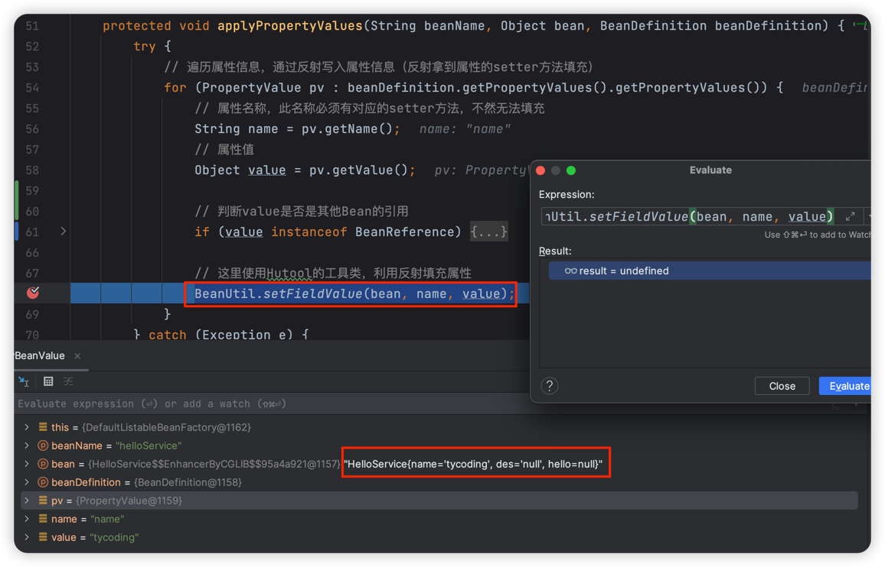
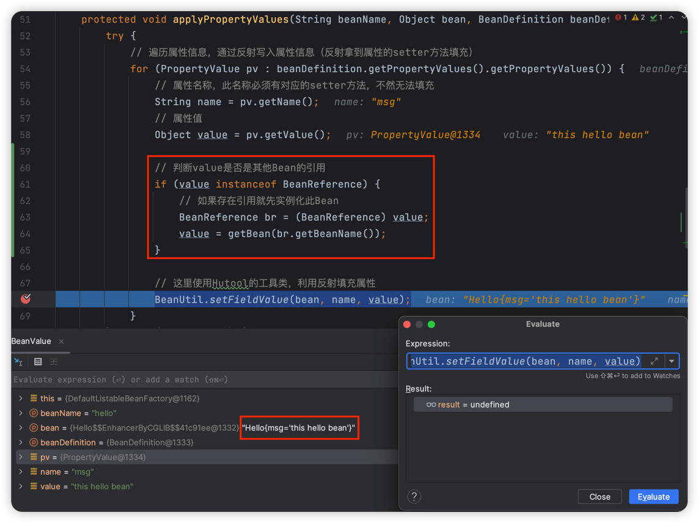

# 填充Bean属性信息

> 当前文档对应Git分支：`03-bean-property-value`

在上一个分支 [02-bean-instance-strategy](../02-bean-instance-strategy/README.md) 中我们完成了Bean的实例化操作，
接下来我们应该为Bean填充属性信息（因为Bean在初始化后只是个空对象）

截止到当前分支，我们先梳理下Bean初始化过程：


## PropertyValue Bean属性信息

```java
public class PropertyValue {

    /**
     * 属性名，必须提供setter方法
     */
    private final String name;

    /**
     * 属性值
     */
    private final Object value;

    public PropertyValue(String name, Object value) {
        this.name = name;
        this.value = value;
    }

    public String getName() {
        return name;
    }

    public Object getValue() {
        return value;
    }
}
```

如上，我们简单模拟Bean的属性信息对象，`name` 对应了Bean中某个属性名称。

**注意：**

比如我们要填充 `Person` 这个Bean，它包含了name和age两个参数，我们想要在初始化Bean的时候就为这两个参数设置一些值；
那么这就需要Spring为其在实例化Bean之后初始化参数；如何初始化，这实际上是利用反射技术拿到Bean属性的setter方法进行填充值。

**因此，Bean需要填充的属性必须提供有对应的setter方法（否则反射会因找不到setter方法而报错）**

## MutablePropertyValues

> 在Spring源码中，还提供了PropertyValues接口，MutablePropertyValues实现了此接口，但是本例中就不再延伸

`MutablePropertyValues` 对象提供操作PropertyValue的具体逻辑：

```java
public class MutablePropertyValues {

    private final List<PropertyValue> propertyValueList = new ArrayList<>();

    /**
     * 添加属，如果已存在就覆盖（合并）
     *
     * @param pv 属性信息
     */
    public void addPropertyValue(PropertyValue pv) {
        for (int i = 0; i < propertyValueList.size(); i++) {
            PropertyValue propertyValue = propertyValueList.get(i);
            if (propertyValue.getName().equals(pv.getName())) {
                // 如果属性名称相同就覆盖
                propertyValueList.set(i, pv);
                return;
            }
        }
        propertyValueList.add(pv);
    }
}
```

如上，其实就是提供一个属性容器List，然后对其set和get操作（这里判断属性名称相同时覆盖value）

## 填充属性

在之前我们知道`createBean`操作定义在`AbstractAutowireCapableBeanFactory`对象中，因此紧接着的填充属性操作也定义在此：

```java
/**
 * 为Bean填充属性信息
 *
 * @param beanName       Bean名称
 * @param bean           Bean对象
 * @param beanDefinition 对象信息
 */
protected void applyPropertyValues(String beanName, Object bean, BeanDefinition beanDefinition) {
    try {
        // 遍历属性信息，通过反射写入属性信息（反射拿到属性的setter方法填充）
        for (PropertyValue pv : beanDefinition.getPropertyValues().getPropertyValues()) {
            // 属性名称，此名称必须有对应的setter方法，不然无法填充
            String name = pv.getName();
            // 属性值
            Object value = pv.getValue();

            // 这里使用Hutool的工具类，利用反射填充属性
            BeanUtil.setFieldValue(bean, name, value);
        }
    } catch (Exception e) {
        throw new BeansException("Error setting property values for bean: " + beanName, e);
    }
}
```

如上为填充的具体逻辑：

1. 从BeanDefinition中拿到所有的属性信息PropertyValues
2. 遍历属性信息集合，拿到对应的属性名称（对应setter方法名）和属性值
3. 利用反射拿到setter方法并填充属性值（这里直接使用Hutool的工具类）

接着只要在实例化Bean后调用此方法填充Bean属性即可：

```java
protected Object doCreateBean(String beanName, BeanDefinition beanDefinition) {
    Object bean = null;
    try {
        bean = createBeanInstance(beanDefinition);
        // 填充属性
        applyPropertyValues(beanName, bean, beanDefinition);
    } catch (Exception e) {
        throw new BeansException("Instantiation of bean failed", e);
    }

    registrySingleton(beanName, bean);
    return bean;
}
```

增加测试类：

```java
/**
 * 测试填充Bean属性
 */
@Test
public void setBeanPropertyValues() {
    DefaultListableBeanFactory beanFactory = new DefaultListableBeanFactory();
    // 设置Bean属性
    MutablePropertyValues propertyValues = new MutablePropertyValues();
    propertyValues.addPropertyValue(new PropertyValue("name", "tycoding"));
    propertyValues.addPropertyValue(new PropertyValue("des", "hello"));
    BeanDefinition beanDefinition = new BeanDefinition(HelloService.class, propertyValues);
    beanFactory.registryBeanDefinition("helloService", beanDefinition);

    HelloService helloService = (HelloService) beanFactory.getBean("helloService");
    helloService.sayHello();
    System.out.println(helloService);
}
```

## Bean引用注入

当Bean属性中包含其他的Bean的引用，应该先实例化此Bean再进行注入引用。

在Spring中涉及了相关解决循环依赖等复杂的逻辑，这里仅仅简单处理，代码如下：

首先增加`BeanReference`：

```java
public class BeanReference {

    private final String beanName;

    public BeanReference(String beanName) {
        this.beanName = beanName;
    }

    public String getBeanName() {
        return beanName;
    }
}
```

修改之前填充Bean属性的逻辑：

```java
protected void applyPropertyValues(String beanName, Object bean, BeanDefinition beanDefinition) {
    try {
        // 遍历属性信息，通过反射写入属性信息（反射拿到属性的setter方法填充）
        for (PropertyValue pv : beanDefinition.getPropertyValues().getPropertyValues()) {
            // 属性名称，此名称必须有对应的setter方法，不然无法填充
            String name = pv.getName();
            // 属性值
            Object value = pv.getValue();
            
            // 判断value是否是其他Bean的引用
            if (value instanceof BeanReference) {
                // 如果存在引用就先实例化此Bean
                BeanReference br = (BeanReference) value;
                value = getBean(br.getBeanName());
            }

            // 这里使用Hutool的工具类，利用反射填充属性
            BeanUtil.setFieldValue(bean, name, value);
        }
    } catch (Exception e) {
        throw new BeansException("Error setting property values for bean: " + beanName, e);
    }
}
```

增加测试类：

```java
/**
 * 测试包含Bean引用的Bean属性填充
 */
@Test
public void setBeanPropertyBeanValue() {
    DefaultListableBeanFactory beanFactory = new DefaultListableBeanFactory();

    // 注入Hello Bean
    MutablePropertyValues beanPros = new MutablePropertyValues();
    beanPros.addPropertyValue(new PropertyValue("msg", "this hello bean"));
    BeanDefinition helloDef = new BeanDefinition(Hello.class, beanPros);
    beanFactory.registryBeanDefinition("hello", helloDef);

    // 注入HelloService Bean
    MutablePropertyValues propertyValues = new MutablePropertyValues();
    propertyValues.addPropertyValue(new PropertyValue("name", "tycoding"));
    propertyValues.addPropertyValue(new PropertyValue("des", "hello"));
    propertyValues.addPropertyValue(new PropertyValue("hello", new BeanReference("hello")));
    BeanDefinition beanDefinition = new BeanDefinition(HelloService.class, propertyValues);
    beanFactory.registryBeanDefinition("helloService", beanDefinition);

    HelloService helloService = (HelloService) beanFactory.getBean("helloService");
    helloService.sayHello();
    System.out.println(helloService);
}
```



当我们手动Evaluate Expression代码`BeanUtil.setFieldValue()`代码后，可以看到`name` 属性已经被填充了值。



可以看到当Bean属性中存在其他Bean引用时，需要实例化其他Bean，然后将此引用作为属性值填充到当前Bean中。

执行结果：

```java
HelloService sayHello()
HelloService{name='tycoding', des='hello', hello=Hello{msg='this hello bean'}}
```