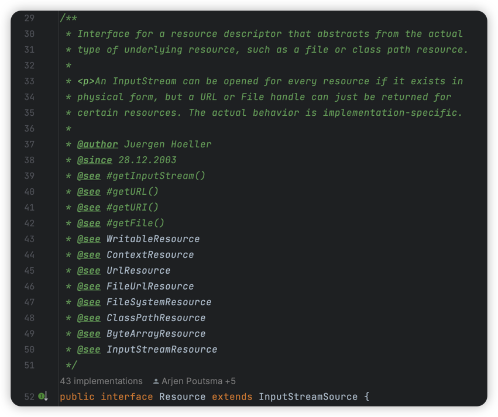

# 加载资源文件（策略模式）

> 当前文档对应Git分支：`04-resource-loader`

在使用Spring时我们经常需要需要加载外部配置文件，这里就使用到Spring的文件加载器。

## Resource接口

在Spring源码中，Resource接口扩展了很多接口和实现类：



总的来说，都是要满足几种读取文件的方式：

1. 从`classpath:`项目相对路径读取（在Maven项目中，这个路径代表`resources`文件夹路径）
2. 从本地磁盘路径读取
3. 从网络URL地址读取

在Spring源码中对Resource接口扩展比较多，其中：
1. 获取文件读取流的是：`InputStreamResource`
2. 获取文件写入流的是：`WriteableResource`

因为本项目仅做读取文件的功能，暂时不做过多扩展，因此直接在`Resource`接口提供`getInputStream()`获取文件读取流即可：

```java
public interface Resource {

    /**
     * 获取文件读取流
     *
     * @return InputStream 对象
     * @throws IOException
     */
    InputStream getInputStream() throws IOException;
}
```

## ResourceLoader

这里使用了**策略模式**，`ResourceLoader` 作为资源加载策略接口：

```java
public interface ResourceLoader {

    /**
     * 根据位置获取资源
     *
     * @param location 资源位置
     * @return
     */
    Resource getResource(String location);
}
```

## DefaultResourceLoader

此实现类作为资源加载策略接口默认实现，内部根据不同条件返回不同的加载策略对象：

```java
public class DefaultResourceLoader implements ResourceLoader {

    public static final String CLASSPATH_URL_PREFIX = "classpath:";

    @Override
    public Resource getResource(String location) {
        if (location.startsWith(CLASSPATH_URL_PREFIX)) {
            // 从本地相对路径获取
            return new ClassPathResource(location.substring(CLASSPATH_URL_PREFIX.length()));
        } else {
            try {
                // 作为URL处理
                URL url = new URL(location);
                return new UrlResource(url);
            } catch (MalformedURLException e) {
                // 从磁盘地址获取
                return new FileSystemResource(location);
            }
        }
    }
}
```

## 加载策略

根据上面提到的，我们需要定义三种不同的加载策略类：

1. ClassPathResource

```java
public class ClassPathResource implements Resource {

    private final String path;

    public ClassPathResource(String path) {
        this.path = path;
    }

    @Override
    public InputStream getInputStream() throws IOException {
        InputStream is = this.getClass().getClassLoader().getResourceAsStream(path);
        if (is == null) {
            throw new FileNotFoundException(path + " cannot be opened because it does not exists");
        }
        return is;
    }
}
```

2. FileSystemResource

```java
public class FileSystemResource implements Resource {

    private final String filePath;

    public FileSystemResource(String filePath) {
        this.filePath = filePath;
    }

    @Override
    public InputStream getInputStream() throws IOException {
        try {
            Path path = new File(filePath).toPath();
            return Files.newInputStream(path);
        } catch (NoSuchFileException e) {
            throw new FileNotFoundException(e.getMessage());
        }
    }
}
```

3. UrlResource

```java
public class UrlResource implements Resource {

    private final URL url;

    public UrlResource(URL url) {
        this.url = url;
    }

    @Override
    public InputStream getInputStream() throws IOException {
        URLConnection connection = url.openConnection();
        try {
            return connection.getInputStream();
        } catch (IOException e) {
            throw new FileNotFoundException(e.getMessage());
        }
    }
}
```

如上，DefaultResourceLoader根据资源位置的不同判断返回哪种加载策略

## 测试

```java
public class ResourceTest {

    /**
     * 加载classpath相对路径资源
     */
    @Test
    public void t1() throws Exception {
        DefaultResourceLoader resourceLoader = new DefaultResourceLoader();
        Resource resource = resourceLoader.getResource("classpath:test.txt");
        InputStream inputStream = resource.getInputStream();
        String str = IoUtil.readUtf8(inputStream);
        System.out.println(str);
    }

    /**
     * 加载磁盘相对路径资源
     */
    @Test
    public void t2() throws Exception {
        DefaultResourceLoader resourceLoader = new DefaultResourceLoader();
        Resource resource = resourceLoader.getResource("src/test/resources/test.txt");
        InputStream inputStream = resource.getInputStream();
        String str = IoUtil.readUtf8(inputStream);
        System.out.println(str);
    }

    /**
     * 加载URL网络路径资源
     */
    @Test
    public void t3() throws Exception {
        DefaultResourceLoader resourceLoader = new DefaultResourceLoader();
        Resource resource = resourceLoader.getResource("https://github.com/TyCoding/mini-spring/tree/main/src/test/resources/test.txt");
        InputStream inputStream = resource.getInputStream();
        String str = IoUtil.readUtf8(inputStream);
        System.out.println(str);
    }
}
```


