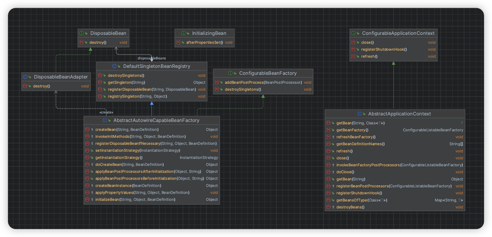
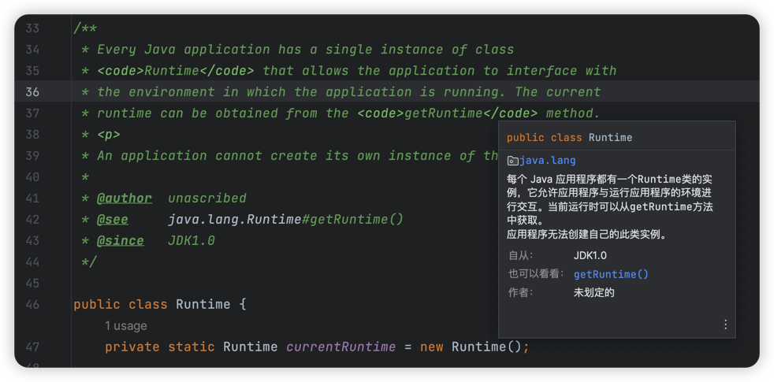
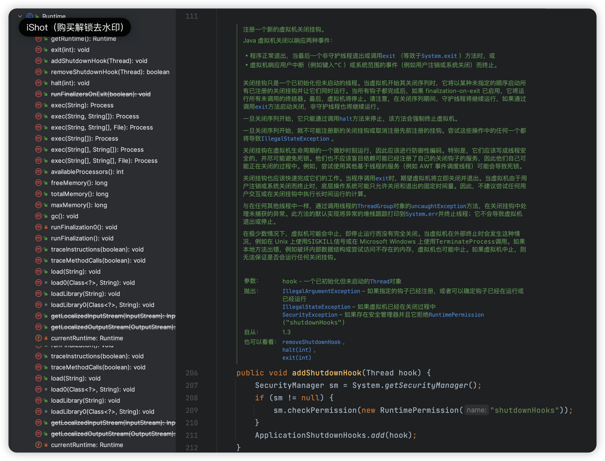

# Bean的init和destroy方法

> 当前文档对应Git分支：`08-bean-init-destroy`

在上一章节中，我们介绍了ApplicationContext上下文接口，主要围绕了`refresh()`方法的实现：

**之前我们提到了BeanFactory的getBean操作仅仅在调用时才会加载Bean到容器中（可以认为是懒加载）；
而实际上Spring在启动时就会加载Bean，Bean的预先加载正是依靠于`refresh()`方法**

`refresh()`方法是面试经常问到的，他的核心作用（到目前为止）：
1. 创建BeanFactory并初始化BeanDefinition
2. 预先注册PostProcessor等处理器Bean
3. 提前实例化单例Bean

既然有了ApplicationContext`refresh()`在启动是统一预先加载Bean，那么也应该有统一销毁Bean的方法。

## 前言

这里我们介绍两个接口：
1. `InitializingBean`: 由BeanFactory完成Bean初始化后要执行的接口（进行Bean整体配置和初始化验证）
2. `DisposableBean`: 销毁Bean释放资源时实现的接口

```java
public interface InitializingBean {

    /**
     * Bean实例初始化完成后，进行整体配置和初始化验证
     */
    void afterPropertiesSet() throws Exception;
}

public interface DisposableBean {

    /**
     * 销毁接口
     */
    void destroy() throws Exception;
}
```



从上图中可以看出，InitializingBean和DisposableBean接口分别处于什么定位：

### initMethod&destroyMethod

介绍之前我们先回顾一下spring-xml文件的`<bean>`标签：

```java
<bean id="initDestroyBean" class="cn.tycoding.context.InitDestroyBean" 
    init-method="customInitMethod" 
    destroy-method="customDestroyMethod">
    
    <property name="name" value="tycoding"/>
</bean>
```

可以看到在标准的XML标签中，是存在`init-method`和`destroy-method`属性的，
他们分别对应了Bean生命周期中自定义初始化执行的方法和销毁时执行的方法。

那么这里介绍的InitializingBean和DisposableBean接口**的作用除了包含对内部容器本身的处理，还包括获取用户自定义的initMethod和destroyMethod方法并执行逻辑**；

### InitializingBean

InitializingBean主要负责当BeanFactory实例化、初始化Bean结束后，对Bean进行整体配置和验证的接口；
因此InitializingBean一定是在`AbstractAutowireCapableBeanFactory`中；

因此只需要在`initializeBean`方法执行时同时执行InitializingBean接口的`afterPropertiesSet()`方法即可；

根据上面的XML文件分析，我们需要拿到BeanDefinition定义的`initMethod`参数值，并通过反射技术从Bean中拿到对应名称的方法Method对象，
然后调用`method.invoke()`即可执行方法；核心代码如下：

```java
protected void invokeInitMethods(String beanName, Object bean, BeanDefinition beanDefinition) throws Exception {
    if (bean instanceof InitializingBean) {
        // 执行子类的init方法
        ((InitializingBean) bean).afterPropertiesSet();
    }
    String initMethod = beanDefinition.getInitMethod();
    if (StrUtil.isNotEmpty(initMethod)) {
        // 这里使用Hutool的反射工具类拿到此方法对象
        Method method = ClassUtil.getPublicMethod(beanDefinition.getBeanClass(), initMethod);
        if (method == null) {
            throw new BeansException("Couldn't find a init method named '" + initMethod + "' on bean with name '" + beanName);
        }
        method.invoke(bean);
    }
}
```

**注：** 在Spring源码中，执行逻辑肯定不止是只处理`initMethod`方法，但是在这里我们仅做这部分逻辑了。

### DisposableBean

因为全局加载Bean的方法`refresh()`是定义在ApplicationContext接口的配置接口ConfigurationApplicationContext中，
因此全局的销毁方法`close()`也应该定义在ConfigurationApplicationContext。

而对于`destroy()`方法，从上图可以看出通过DisposableBean接口的适配器实现类DisposableBeanAdapter处理；
而DisposableBean接口会暴露在DefaultSingletonBeanRegistry中，也就是对应了`destroySingletons()`方法，此方法除了执行destroy方法就是销毁单例Bean容器。

因此，根据上图我们知道了，最终`destroySingletons`方法是暴露在beanFactory中的，可以通过beanFactory去调用具体的销毁方法即可。

核心代码如下：

```java
@Override
public void destroy() throws Exception {
    if (bean instanceof DisposableBean) {
        // 执行子类的destroy方法
        ((DisposableBean) bean).destroy();
    }

    // 避免同时继承DisposableBean且方法名也是destroy，destroy方法执行两次的情况
    if (StrUtil.isNotEmpty(destroyMethodName) && !(bean instanceof DisposableBean && "destroy".equals(this.destroyMethodName))) {
        Method method = ClassUtil.getPublicMethod(bean.getClass(), destroyMethodName);
        if (method == null) {
            throw new BeansException("Couldn't find a destroy method name '" + destroyMethodName + "' on bean with name '" + beanName + "'");
        }
        method.invoke(bean);
    }
}
```

### ShutdownHook

上面介绍的destroy方法仅是提供一个销毁Bean的方法，而其上层调用就发生在`ConfigurableApplicationContext`的`close()`方法上；

也就是通过`close()`方法再去调用beanFactory的`destroySingletons()`方法执行销毁逻辑（和refresh设计类似）。

但其实`close()`方法仍是需要主动调用才会执行的，而实际上Spring在启动时就通过ApplicationContext的refresh方法提前实例化Bean，
那么也应该想项目关闭时主动去销毁JVM中已经实例化的Bean对象并释放资源。

因此这里用到JDK的`Runtime`对象，源码解释：





如上可以知道`Runtime.addShutdownHook()`方法可以增加一个守护线程，在JVM关闭时会执行；
因此在`ConfigurableApplicationContext`的`registerShutdownHook()`方法实现中，核心是注册一个新线程，并在线程内部调用`close()`方法即可。

核心代码：

```java
@Override
public void registerShutdownHook() {
    Thread shutdownHook = new Thread() {
        @Override
        public void run() {
            doClose();
        }
    };
    Runtime.getRuntime().addShutdownHook(shutdownHook);
}
```

## DisposableBeanAdapter

```java
public class DisposableBeanAdapter implements DisposableBean {

    private final String beanName;
    private final Object bean;

    private final String destroyMethodName;

    public DisposableBeanAdapter(String beanName, Object bean, String destroyMethodName) {
        this.beanName = beanName;
        this.bean = bean;
        this.destroyMethodName = destroyMethodName;
    }

    @Override
    public void destroy() throws Exception {
        if (bean instanceof DisposableBean) {
            // 执行子类的destroy方法
            ((DisposableBean) bean).destroy();
        }

        // 避免同时继承DisposableBean且方法名也是destroy，destroy方法执行两次的情况
        if (StrUtil.isNotEmpty(destroyMethodName) && !(bean instanceof DisposableBean && "destroy".equals(this.destroyMethodName))) {
            Method method = ClassUtil.getPublicMethod(bean.getClass(), destroyMethodName);
            if (method == null) {
                throw new BeansException("Couldn't find a destroy method name '" + destroyMethodName + "' on bean with name '" + beanName + "'");
            }
            method.invoke(bean);
        }
    }
}
```

## AbstractAutowireCapableBeanFactory

```java
public abstract class AbstractAutowireCapableBeanFactory extends AbstractBeanFactory implements AutowireCapableBeanFactory {

    protected Object doCreateBean(String beanName, BeanDefinition beanDefinition) {
        Object bean = null;
        try {
            bean = createBeanInstance(beanDefinition);
            // 填充属性
            ...

            // 初始化Bean
            ...
        } catch (Exception e) {
            throw new BeansException("Instantiation of bean failed", e);
        }

        // 注册有销毁方法的Bean
        registerDisposableBeanIfNecessary(beanName, bean, beanDefinition);

        registrySingleton(beanName, bean);
        return bean;
    }

    /**
     * 初始化Bean
     *
     * @param beanName       Bean名称
     * @param bean           Bean实例
     * @param beanDefinition Bean定义
     * @return 初始化后的Bean实例
     */
    protected Object initializeBean(String beanName, Object bean, BeanDefinition beanDefinition) {
        // 执行BeanPostProcessor的前置处理器
        Object wrappedBean = applyBeanPostProcessorsBeforeInitialization(bean, beanName);

        // 初始化Bean
        try {
            invokeInitMethods(beanName, bean, beanDefinition);
        } catch (Exception e) {
            throw new BeansException("Invocation of init method bean[" + beanName + "] failed", e);
        }

        // 执行BeanPostProcessor的后置处理器
        wrappedBean = applyBeanPostProcessorsAfterInitialization(bean, beanName);
        return wrappedBean;
    }

    /**
     * 初始化Bean的详细逻辑
     *
     * @param beanName       Bean名称
     * @param bean           Bean实例
     * @param beanDefinition Bean定义
     * @return 初始化后的Bean实例
     */
    protected void invokeInitMethods(String beanName, Object bean, BeanDefinition beanDefinition) throws Exception {
        if (bean instanceof InitializingBean) {
            // 执行子类的init方法
            ((InitializingBean) bean).afterPropertiesSet();
        }
        String initMethod = beanDefinition.getInitMethod();
        if (StrUtil.isNotEmpty(initMethod)) {
            // 这里使用Hutool的反射工具类拿到此方法对象
            Method method = ClassUtil.getPublicMethod(beanDefinition.getBeanClass(), initMethod);
            if (method == null) {
                throw new BeansException("Couldn't find a init method named '" + initMethod + "' on bean with name '" + beanName);
            }
            method.invoke(bean);
        }
    }

    /**
     * 注册有销毁方法的Bean
     */
    protected void registerDisposableBeanIfNecessary(String beanName, Object bean, BeanDefinition beanDefinition) {
        // 只有singletons类型的Bean才有销毁方法
        if (beanDefinition.isSingleton()) {
            if (bean instanceof DisposableBean || StrUtil.isNotEmpty(beanDefinition.getDestroyMethod())) {
                registerDisposableBean(beanName, new DisposableBeanAdapter(beanName, bean, beanDefinition.getDestroyMethod()));
            }
        }
    }
    
    ...
}
```

## DefaultSingletonBeanRegistry

```java
public class DefaultSingletonBeanRegistry implements SingletonBeanRegistry {

    private final Map<String, DisposableBean> disposableBeans = new HashMap<>();

    ...

    public void removeSingleton(String beanName) {
        singletonObjects.remove(beanName);
    }

    public void destroySingletons() {
        Set<String> beanNames = disposableBeans.keySet();
        for (String beanName : beanNames) {
            DisposableBean disposableBean = disposableBeans.remove(beanName);
            try {
                disposableBean.destroy();

                // 销毁单例Bean
                removeSingleton(beanName);
            } catch (Exception e) {
                throw new BeansException("Destroy method on bean with name '" + beanName + "' throw a exception", e);
            }
        }
    }
}
```

## ConfigurableApplicationContext

```java
public interface ConfigurableApplicationContext extends ApplicationContext {

    /**
     * 加载或刷新容器
     */
    void refresh() throws BeansException;

    /**
     * 关闭应用上下文
     */
    void close();

    /**
     * 向虚拟机中注册一个钩子函数，在虚拟机关闭之前执行关闭容器等操作
     */
    void registerShutdownHook();
}
```

## AbstractApplicationContext

```java
public abstract class AbstractApplicationContext extends DefaultResourceLoader implements ConfigurableApplicationContext {

    ...

    @Override
    public void close() {
        doClose();
    }

    @Override
    public void registerShutdownHook() {
        Thread shutdownHook = new Thread() {
            @Override
            public void run() {
                doClose();
            }
        };
        Runtime.getRuntime().addShutdownHook(shutdownHook);
    }

    protected void doClose() {
        destroyBeans();
    }

    protected void destroyBeans() {
        getBeanFactory().destroySingletons();
    }

    ...
}
```