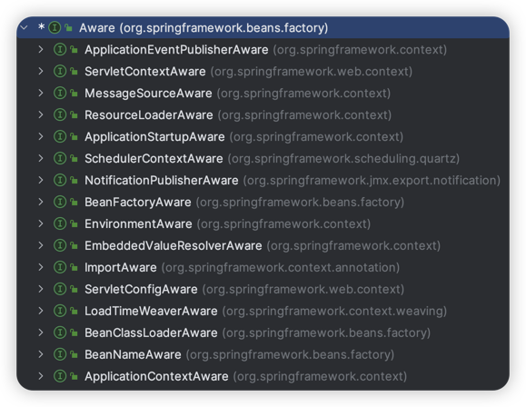
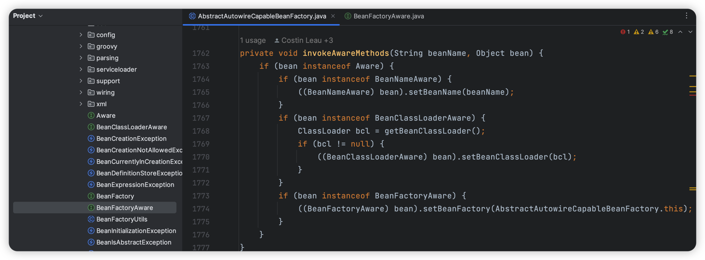

# Spring的Aware接口实现

> 当前文档对应Git分支：`09-spring-aware`

Spring的Aware接口是一个标记接口，实现该接口的类具有让Spring容器感知的能力，并可以拿到对应的容器对象。



如上是Spring源码中Aware接口子接口，我们可以简单认为`XxxAware`中的`Xxx`就是这个接口要获取的容器对象；

- 比如`BeanNameAware`，继承该接口就能拿到Spring容器中该Bean所属的BeanName信息；
- 比如`BeanFactoryAware`，继承该接口就能拿到Spring容器中该Bean所属的BeanFactory对象；

那么，Spring如何体现的容器的感知能力呢？我们拿`BeanFactoryAware`来分析：

我们知道`BeanFactoryAware`接口作用就是获取Bean所属BeanFactory对象，那么`BeanFactory`对象在哪生产的？

在前面的章节中我们知道`AbstractAutowireCapableBeanFactory`类最终是负责`createBean()`的，
而BeanFactory核心就是负责Bean容器管理，那么是不是**在完成了Bean的初始化后，再判断如果实现了`BeanFactoryAware`接口就主动设置BeanFactory对象就能实现感知能力呢？**



看上述Spring源码，可以知道Spring确实是这么做的；上面的`setBeanName()`、`setBeanClassLoader()`、`setBeanFactory()`分别对应了
BeanNameAware、BeanClassLoaderAware、BeanFactoryAware接口，然后主动去设置称当前容器的对象即可。

是不是现在看起来就很清晰了呢？

## Aware接口

Aware

```java
public interface Aware {
}
```

BeanFactoryAware

```java
public interface BeanFactoryAware extends Aware {

    /**
     * 设置BeanFactory对象
     */
    void setBeanFactory(BeanFactory beanFactory) throws BeansException;
}
```

ApplicationContextAware

```java
public interface ApplicationContextAware extends Aware {

    /**
     * 设置ApplicationContext对象
     */
    void setApplicationContext(ApplicationContext applicationContext) throws BeansException;
}
```

如上我们仅写这三个接口，在Spring源码中，该接口也是这样定义的，只包含了一个set方法

## AbstractAutowireCapableBeanFactory

BeanFactoryAware接口实现在这里完成：

```java
protected Object initializeBean(String beanName, Object bean, BeanDefinition beanDefinition) {
    if (bean instanceof BeanFactoryAware) {
        ((BeanFactoryAware) bean).setBeanFactory(this);
    }

    ...
}
```

省略其他的代码，核心只有一条，如果有Bean实现了`BeanFactoryAware`接口，就主动调用其set方法，那么对应的接口实现类就能拿到set的对象。

## ApplicationContextAwareProcessor

ApplicationContextAware接口的实现，在Spring中是通过一个单独的BeanPostProcessor处理器实现的；

我们知道ApplicationContext接口核心是`refresh`方法，这个方法用于预先全局初始化容器对象；
因此在`refresh`中我们无法直接拿到Bean对象，但是在这里会加载BeanPostProcessor处理器，我们通过该处理器也可以拿到Bean对象，
然后便可像BeanFactoryAware实现一样处理set：

```java
public class ApplicationContextAwareProcessor implements BeanPostProcessor {

    private final ApplicationContext applicationContext;

    public ApplicationContextAwareProcessor(ApplicationContext applicationContext) {
        this.applicationContext = applicationContext;
    }

    @Override
    public Object postProcessBeforeInitialization(Object bean, String beanName) throws BeansException {
        if (bean instanceof ApplicationContextAware) {
            ((ApplicationContextAware) bean).setApplicationContext(applicationContext);
        }
        return bean;
    }

    @Override
    public Object postProcessAfterInitialization(Object bean, String beanName) throws BeansException {
        return bean;
    }
}
```

```java
public abstract class AbstractApplicationContext extends DefaultResourceLoader implements ConfigurableApplicationContext {

    @Override
    public void refresh() throws BeansException {
        // 创建BeanFactory并初始化BeanDefinition
        refreshBeanFactory();
        ConfigurableListableBeanFactory beanFactory = getBeanFactory();

        // 创建ApplicationContextAwareProcessor，让实现ApplicationContextAware接口能感知到ApplicationContext对象
        beanFactory.addBeanPostProcess(new ApplicationContextAwareProcessor(this));

        // 实例化Bean之前先加载BeanFactoryPostProcessor处理器
        invokeBeanFactoryPostProcessors(beanFactory);

        // BeanPostProcessor要在其他Bean实例化之前注册
        registerBeanPostProcessors(beanFactory);

        // 提前实例化单例Bean
        beanFactory.preInstantiateSingletons();
    }
}
```

## 测试

AwareHelloService

```java
public class AwareHelloService implements ApplicationContextAware, BeanFactoryAware {

    private ApplicationContext applicationContext;
    private BeanFactory beanFactory;

    public void sayHello() {
        System.out.println("HelloService sayHello()");
    }

    @Override
    public void setBeanFactory(BeanFactory beanFactory) throws BeansException {
        this.beanFactory = beanFactory;
    }

    @Override
    public void setApplicationContext(ApplicationContext applicationContext) throws BeansException {
        this.applicationContext = applicationContext;
    }

    public ApplicationContext getApplicationContext() {
        return applicationContext;
    }

    public BeanFactory getBeanFactory() {
        return beanFactory;
    }
}
```

AwareInterfaceTest

```java
public class AwareInterfaceTest {

    @Test
    public void t1() {
        ClassPathXmlApplicationContext applicationContext = new ClassPathXmlApplicationContext("classpath:spring-aware.xml");
        AwareHelloService awareHelloService = applicationContext.getBean("awareHelloService", AwareHelloService.class);
        System.out.println(awareHelloService.getApplicationContext());
        System.out.println(awareHelloService.getBeanFactory());
    }
}
```

spring-aware.xml

```xml
    <bean id="awareHelloService" class="cn.tycoding.spring.beans.factory.AwareHelloService"/>
```


