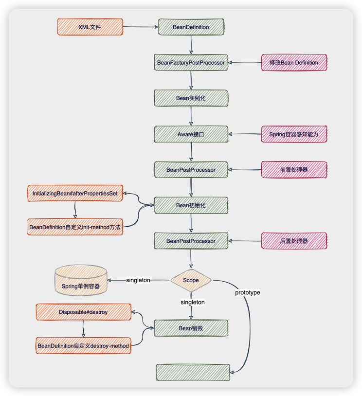

# Bean作用域

> 当前文档对应Git分支：`10-prototype-bean`

## Scope

Scope是指Spring容器创建的Bean对象对于其他Bean对象的请求可见范围。

scope分类：singleton、prototype、request、session、global session（后三种都是对于Web阶段）

例如：singleton类型下Bean在Spring容器中始终只有一个共享实例。（具体实现中我们先判断是否是singleton，是则每次从同一个Map中存取，以此通过key保证唯一）

除此之外，在前面定义BeanDefinition时（XML文件），除了`scope`属性还用到了：

- `init-method`：在创建Bean时调用的方法（非创建Bean的方法）；
- `destroy-method`：在销毁Bean时调用的方法（非销毁Bean的方法）；

因此，当Bean的可见范围是prototype（多例），就不再通过DefaultSingletonBeanRegistry管理Bean对象，Spring容器每次创建完Bean实例后也就不再保存该Bean的引用，创建后直接返回；

也就是当prototype模式下，Bean生命周期的管理不再交由Spring，而是调用者本身去管理；
因此，prototype模式下Spring不再执行`destroy-method`销毁方法。

自此，Bean的生命周期如下：



## AbstractAutowireCapableBeanFactory

```java
protected Object doCreateBean(String beanName, BeanDefinition beanDefinition) {
    Object bean = null;
    try {
        bean = createBeanInstance(beanDefinition);
        // 填充属性
        applyPropertyValues(beanName, bean, beanDefinition);

        // 初始化Bean
        initializeBean(beanName, bean, beanDefinition);
    } catch (Exception e) {
        throw new BeansException("Instantiation of bean failed", e);
    }

    // 注册有销毁方法的Bean
    registerDisposableBeanIfNecessary(beanName, bean, beanDefinition);

    if (beanDefinition.isSingleton()) {
        registrySingleton(beanName, bean);
    }
    return bean;
}

protected void registerDisposableBeanIfNecessary(String beanName, Object bean, BeanDefinition beanDefinition) {
    // 只有singletons类型的Bean才有销毁方法
    if (beanDefinition.isSingleton()) {
        if (bean instanceof DisposableBean || StrUtil.isNotEmpty(beanDefinition.getDestroyMethod())) {
            registerDisposableBean(beanName, new DisposableBeanAdapter(beanName, bean, beanDefinition.getDestroyMethod()));
        }
    }
}
```

## 测试

```java
public class PrototypeBeanTest {

    /**
     * 测试不同bean scope类型
     */
    @Test
    public void t1() {
        ClassPathXmlApplicationContext applicationContext = new ClassPathXmlApplicationContext("classpath:spring-prototype-bean.xml");
        Hello singletonHello = applicationContext.getBean("singletonHello", Hello.class);
        Hello singletonHello2 = applicationContext.getBean("singletonHello", Hello.class);
        System.out.println(singletonHello == singletonHello2);

        Hello prototypeHello = applicationContext.getBean("prototypeHello", Hello.class);
        Hello prototypeHello2 = applicationContext.getBean("prototypeHello", Hello.class);
        System.out.println(prototypeHello == prototypeHello2);
    }
}
```
spring-prototype-bean.xml

```xml
<?xml version="1.0" encoding="UTF-8"?>
<beans xmlns="http://www.springframework.org/schema/beans"
       xmlns:xsi="http://www.w3.org/2001/XMLSchema-instance"
       xmlns:util="http://www.springframework.org/schema/util" xsi:schemaLocation="
        http://www.springframework.org/schema/beans http://www.springframework.org/schema/beans/spring-beans.xsd
        http://www.springframework.org/schema/util http://www.springframework.org/schema/util/spring-util.xsd"> <!-- bean definitions here -->

    <bean id="singletonHello" class="cn.tycoding.spring.beans.factory.Hello"/>
    <bean id="prototypeHello" class="cn.tycoding.spring.beans.factory.Hello" scope="prototype"/>
</beans>
```

结果：true false