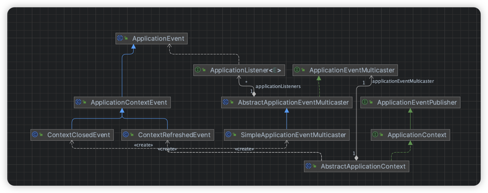
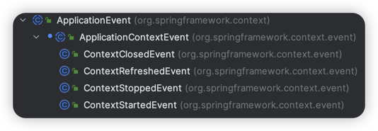
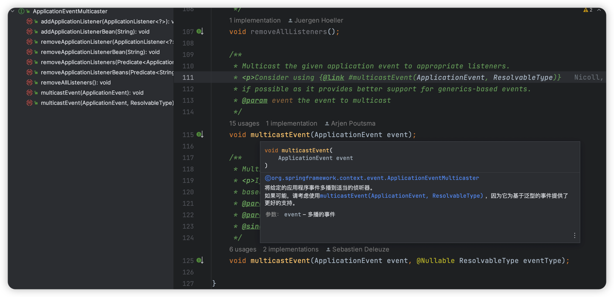
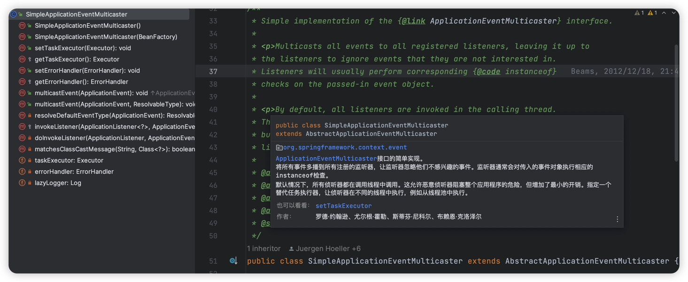

# Spring的事件机制

> 当前文档对应Git分支：`12-spring-event`

Spring的事件机制提供了事件发布和监听的实现，用于业务代码之间的解耦，事件机制本身通过观察者模式实现。

**观察者模式**

> 观察者模式定义了一对多的关系，一个被观察者对象可以被多个观察者监听，当主题对象发生变化，会通知依赖他的所有观察者。

观察者的主要组成：

- Subject被观察者（抽象）：定义被观察者必须实现的指责，它能动态的增删观察者
- Observe观察者（抽象）：观察者接收到消息后，对消息处理
- ConcreteSubject具体被观察者：定义具体被观察者自己的逻辑
- ConcreteObserve具体观察者：定义具体观察者接收到消息的具体处理逻辑

## 前言

结合上面的观察者模式组成，我们分析一个事件订阅/发布功能的实现需要什么呢？

1. Event事件  -- 主题，Subject（应该是有一个用于发布主题的接口）
2. Listener监听器  -- Observe
3. Publisher发布器  -- Subject发布主题的具体实现

也就是通过触发发布器发布一个事件，再广播给对应的监听器，监听器监听到事件后做具体消息处理。

接下来看下代码实现中我们新增的接口：



要知道，我们这里讨论的**事件源是ApplicationContext**，也就是围绕ApplicationContext对象的相关事件；
可以这么认为，ApplicationContext上下文是整个IOC容器最上层的对象，他包含了整个IOC阶段容器的管理；

因此，我们对这个上下文做事件监听是有意义的；但是再细化例如做Bean实例化的事件监听我们有BeanPostProcessor处理器，因此对这种维度的细化事件作为**事件源**是没有意义的。

### Event

首先定义了一个抽象的顶层事件`ApplicationEvent`，而对于ApplicationContext的相关事件，使用了`ApplicationContextEvent`作为子类事件；

而ApplicationContext相关的具体事件有很多（例如：`ContextCloseEvent`ApplicationContext关闭时触发的事件），都继承了`ApplicationContextEvent`；

那么在Spring源码中，ApplicationContext都定义了哪些事件呢？



### Listener

事件的监听器，定义了一个顶层接口`ApplicationListener`，这是一个范型接口，范型`E`代表了具体的Event事件；

而业务中监听器Listener的具体处理由`ApplicationListener`接口的实现类做具体处理。

### Publisher

因为当前针对的事件源是ApplicationContext，因此围绕ApplicationContext的事件触发应该在`AbstractApplicationContext`对象中，
因此事件发布方法我们也定义在此对象中；

> 事件发布功能如何实现？

核心思想是，当外部触发发布事件方法时，要拿到此事件匹配的事件监听器Listener，并对这些匹配的Listener进行广播通知，
如此Listener便可拿到发布的事件通知，再由子实现类做具体处理。

> Spring源码中怎么解释事件的广播机制？



在Spring源码中事件广播机制的具体定义接口是`ApplicationEventMulticaster`，其中核心方法`multicastEvent()`的唯一实现类是：`SimpleApplicationEventMulticaster`；



而看注释，Spring源码中对事件的广播机制实现其实是**将事件广播到所有注册的监听器中**，而交由Listener做事件判断处理；

## Event

ApplicationEvent

```java
public abstract class ApplicationEvent extends EventObject {

    public ApplicationEvent(Object source) {
        super(source);
    }
}
```

ApplicationContextEvent

```java
public abstract class ApplicationContextEvent extends ApplicationEvent {

    public ApplicationContextEvent(Object source) {
        super(source);
    }

    /**
     * 获取事件产生的ApplicationContext对象
     */
    public final ApplicationContext getApplicationContext() {
        return (ApplicationContext) getSource();
    }
}
```

ContextClosedEvent

```java
public class ContextClosedEvent extends ApplicationContextEvent {

    public ContextClosedEvent(Object source) {
        super(source);
    }
}
```

ContextRefreshedEvent

```java
public class ContextRefreshedEvent extends ApplicationContextEvent {

    public ContextRefreshedEvent(Object source) {
        super(source);
    }
}
```

## Listener

```java
public interface ApplicationListener<E extends ApplicationEvent> extends EventListener {

    /**
     * 要处理的事件
     */
    void onApplicationEvent(E event);
}
```

## Multicaster

可以认为EventMulticaster在当前的观察者模式中作为事件的观察者，他定义了对监听者增加或者删除的接口：

ApplicationEventMulticaster

```java
public interface ApplicationEventMulticaster {

    /**
     * 添加一个监听器以接收所有事件通知
     *
     * @param listener 事件监听器
     */
    void addApplicationListener(ApplicationListener<?> listener);

    /**
     * 删除一个监听器
     *
     * @param listener 事件监听器
     */
    void removeApplicationListener(ApplicationListener<?> listener);

    /**
     * 将给定的事件多播到适当的监听器
     *
     * @param event 事件
     */
    void multicastEvent(ApplicationEvent event);
}
```

AbstractApplicationEventMulticaster 抽象实现主要用于实现监听者管理的逻辑

```java
public abstract class AbstractApplicationEventMulticaster implements ApplicationEventMulticaster, BeanFactoryAware {

    public final Set<ApplicationListener<ApplicationEvent>> applicationListeners = new HashSet<>();

    private BeanFactory beanFactory;

    @Override
    public void addApplicationListener(ApplicationListener<?> listener) {
        applicationListeners.add((ApplicationListener<ApplicationEvent>) listener);
    }

    @Override
    public void removeApplicationListener(ApplicationListener<?> listener) {
        applicationListeners.remove(listener);
    }

    @Override
    public void setBeanFactory(BeanFactory beanFactory) throws BeansException {
        this.beanFactory = beanFactory;
    }
}
```

SimpleApplicationEventMulticaster 核心的事件广播机制实现逻辑：

```java
public class SimpleApplicationEventMulticaster extends AbstractApplicationEventMulticaster {

    public SimpleApplicationEventMulticaster(BeanFactory beanFactory) {
        setBeanFactory(beanFactory);
    }

    @Override
    public void multicastEvent(ApplicationEvent event) {
        for (ApplicationListener<ApplicationEvent> applicationListener : applicationListeners) {
            if (supportsEvent(applicationListener, event)) {
                applicationListener.onApplicationEvent(event);
            }
        }
    }

    protected boolean supportsEvent(ApplicationListener<ApplicationEvent> applicationListener, ApplicationEvent event) {
        // 调用getGenericInterfaces()目的是拿到范型接口，正常通过class.getGenericInterfaces()即可获取到
        // 但是项目使用了Cglib代理生成Bean实例，因此先调用getSuperclass()方法拿到上层被代理类的Class对象（因为代理类是继承被代理类实现的）
        Type type = applicationListener.getClass().getSuperclass().getGenericInterfaces()[0];
        if (type instanceof ParameterizedType) {
            Type argument = ((ParameterizedType) type).getActualTypeArguments()[0];
            String className = argument.getTypeName();
            Class<?> eventClassName;
            try {
                eventClassName = Class.forName(className);
            } catch (ClassNotFoundException e) {
                throw new BeansException("Wrong event class name: " + className);
            }
            return eventClassName.isAssignableFrom(event.getClass());
        }
        return false;
    }
}
```

可以看到在进行广播消息时，我们进行了如下处理：

1. 循环所有监听者
2. 通过反射拿到监听者对象实现的泛型接口，也就是拿到泛型中定义的事件类
3. 通过反射拿到泛型中的事件类和当前的事件做匹配，判断是否有（继承关系）相同
4. 如果Listener的范型事件和当前事件匹配，就返回true，也就对此Listener广播消息

**注意：**

- 因为这里使用了Cglib代理，想要拿到范型接口，必须先获取代理类上层的被代理类对象（因为代理类继承自被代理类）；
- 其次，在Spring源码中，这块的处理比较复杂，Spring封装了自己处理代理类的对象`ResolvableType`，这里不再做扩展；

## Publisher

ApplicationEventPublisher

```java
public interface ApplicationEventPublisher {

    /**
     * 发布事件
     */
    void publishEvent(ApplicationEvent event);
}
```

ApplicationContext

```java
public interface ApplicationContext extends ListableBeanFactory, HierarchicalBeanFactory, ResourceLoader, ApplicationEventPublisher {
}
```

具体的发布实现定义在AbstractApplicationContext对象中：

```java
public abstract class AbstractApplicationContext extends DefaultResourceLoader implements ConfigurableApplicationContext {

    private static final String APPLICATION_EVENT_MULTICASTER_BEAN_NAME = "applicationEventMulticaster";
    private ApplicationEventMulticaster applicationEventMulticaster;

    @Override
    public void refresh() throws BeansException {
        // 创建BeanFactory并初始化BeanDefinition
        refreshBeanFactory();
        ConfigurableListableBeanFactory beanFactory = getBeanFactory();

        // 创建ApplicationContextAwareProcessor，让实现ApplicationContextAware接口能感知到ApplicationContext对象
        beanFactory.addBeanPostProcess(new ApplicationContextAwareProcessor(this));

        // 实例化Bean之前先加载BeanFactoryPostProcessor处理器
        invokeBeanFactoryPostProcessors(beanFactory);

        // BeanPostProcessor要在其他Bean实例化之前注册
        registerBeanPostProcessors(beanFactory);

        // 初始化事件发布者
        initApplicationEventMulticaster();

        // 注册事件监听器
        registerListeners();

        // 提前实例化单例Bean
        beanFactory.preInstantiateSingletons();

        // 发布容器初始化事件
        finishRefresh();
    }

    @Override
    public void close() {
        doClose();
    }

    @Override
    public void registerShutdownHook() {
        Thread shutdownHook = new Thread() {
            @Override
            public void run() {
                doClose();
            }
        };
        Runtime.getRuntime().addShutdownHook(shutdownHook);
    }

    protected void doClose() {
        // 发布容器关闭事件
        publishEvent(new ContextClosedEvent(this));

        ...
    }

    /**
     * 初始化事件发布者
     */
    protected void initApplicationEventMulticaster() {
        ConfigurableListableBeanFactory beanFactory = getBeanFactory();
        applicationEventMulticaster = new SimpleApplicationEventMulticaster(beanFactory);
        beanFactory.registrySingleton(APPLICATION_EVENT_MULTICASTER_BEAN_NAME, applicationEventMulticaster);
    }

    /**
     * 注册事件监听器
     */
    protected void registerListeners() {
        Collection<ApplicationListener> listeners = getBeansOfType(ApplicationListener.class).values();
        for (ApplicationListener listener : listeners) {
            applicationEventMulticaster.addApplicationListener(listener);
        }
    }

    /**
     * 发布容器初始化或刷新完成的事件
     */
    protected void finishRefresh() {
        publishEvent(new ContextRefreshedEvent(this));
    }

    @Override
    public void publishEvent(ApplicationEvent event) {
        applicationEventMulticaster.multicastEvent(event);
    }

    ...
}
```

## 测试

CustomEvent

```java
public class CustomEvent extends ApplicationContextEvent {

    public CustomEvent(ApplicationContext source) {
        super(source);
    }
}
```

CustomEventListener

```java
public class CustomEventListener implements ApplicationListener<CustomEvent> {

    @Override
    public void onApplicationEvent(CustomEvent event) {
        System.out.println("自定义事件监听器");
    }
}
```

ContextRefreshedEventListener

```java
public class ContextRefreshedEventListener implements ApplicationListener<ContextRefreshedEvent> {

    @Override
    public void onApplicationEvent(ContextRefreshedEvent event) {
        System.out.println("自定义Context初始化事件监听");
    }
}
```

ContextClosedEventListener

```java
public class ContextClosedEventListener implements ApplicationListener<ContextClosedEvent> {

    @Override
    public void onApplicationEvent(ContextClosedEvent event) {
        System.out.println("自定义Context关闭后事件监听");
    }
}
```

application-event.xml

```xml
<?xml version="1.0" encoding="UTF-8"?>
<beans xmlns="http://www.springframework.org/schema/beans"
       xmlns:xsi="http://www.w3.org/2001/XMLSchema-instance"
       xmlns:util="http://www.springframework.org/schema/util" xsi:schemaLocation="
        http://www.springframework.org/schema/beans http://www.springframework.org/schema/beans/spring-beans.xsd
        http://www.springframework.org/schema/util http://www.springframework.org/schema/util/spring-util.xsd"> <!-- bean definitions here -->


    <bean id="contextClosedEventListener" class="cn.tycoding.context.event.ContextClosedEventListener"/>
    <bean id="contextRefreshedEventListener" class="cn.tycoding.context.event.ContextRefreshedEventListener"/>
    <bean id="customEventListener" class="cn.tycoding.context.event.CustomEventListener"/>

</beans>
```

测试，应该依次执行我们自定义的三个事件监听器

```java
public class ApplicationEventTest {

    @Test
    public void t1() {
        ClassPathXmlApplicationContext applicationContext = new ClassPathXmlApplicationContext("classpath:application-event.xml");
        applicationContext.publishEvent(new CustomEvent(applicationContext));
        applicationContext.registerShutdownHook();
    }
}
```

打印结果：

```java
自定义Context初始化事件监听
自定义事件监听器
自定义Context关闭后事件监听
```