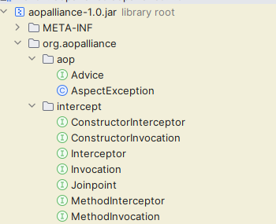
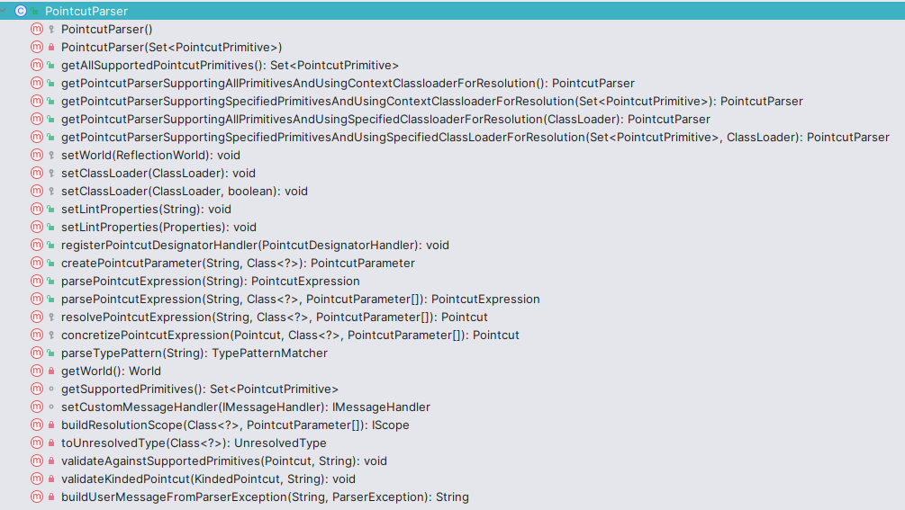

# Aop AspectJ切面表达式

> 当前文档对应Git分支：`13-aspectj-expression`

**注意：** 本章节（文档）仅引入切面表达式的使用，后续将依次介绍AOP中其他的组成部分的应用；

## 引入

Aop -Aspect Orient Programming 面向切面编程，是对面向对象编程的一种补充；
主要应用与处理一些具有横切性质的系统服务，如：日志收集、缓存等操作；

面向切面编程AOP是一种编程范式，旨在通过允许横切关注点的分离，提高模块化；这里我们只讨论两个流行的AOP框架：Spring Aop和AspectJ

> 实现核心

Aop实现的关键在于Aop框架自动生成Aop代理，Aop代理分为静态代理和动态代理：

1. 静态代理：使用Aop框架提供的编译器编译，在编译阶段生成Aop代理类，称为编译时增强；
2. 动态代理：借助JDK或Cglib动态代理在运行时动态生成Aop代理类，称为运行时增强；


> Aop的组成

1. Pointcut: 一组基于正则的表达式；约定的是代码中的某些执行点（可以是一个类、也可以是类中的具体函数）
2. JoinPoint: 通过Pointcut集合中选取的一个具体的执行点
3. Advice: 在选取的JoinPoint上要执行的操作、逻辑；一般包含了Before、After、Around几种方式；
4. Aspect: 关注点的模块化，这个关注点可能会横切多个对象和模块
5. Weaving: 织入，在目标对象中插入切面代码的过程叫做织入

### AspectJ

AspectJ是一个AOP框架，定义了AOP的一些语法，有专门的字节码生成器编译生成class；
AspectJ在编译时就生成了新的代理类，代理类增强了原有业务类的功能，因此AspectJ是静态代理；

AspectJ的Advice通知类型除了上面的：前置通知、后置通知、环绕通知，还有一些异常通知，执行结果通知等；

切面表达式语法：

```java
execution(
    modifiers-pattern? //访问权限匹配   如public、protected
    ret-type-pattern //返回值类型匹配
    declaring-type-pattern? //全限定性类名
    name-pattern(param-pattern) //方法名(参数名)
    throws-pattern? //抛出异常类型
)
```

### Spring Aop

参考：[https://segmentfault.com/a/1190000020621578](https://segmentfault.com/a/1190000020621578)

Spring Aop也是对目标增强，生成代理类；**和AspectJ最大区别是SpringAop在运行时通过动态代理增强，而AspectJ是编译时静态代理生成**

> Spring Aop和AspectJ的无关性

当不使用Spring Aop的注解时，Spring Aop和AspectJ没有关系，Spring Aop核心是通过Cglib动态代理在运行时生成代理类；

> Spring Aop和AspectJ的有关性

当使用Spring Aop的@Before @After等注解时，Spring Aop和AspectJ有了关系；
因为Spring Aop使用了AspectJ提供的Annotation；遵循了AspectJ的规范

**注意：：** Spring Aop是和Spring的IOC容器紧密联系的，因此Spring Aop中的切面、代理类一定都是IOC容器管理的

> Spring Aop的局限性

Spring Aop是基于动态代理机制，而动态代理技术生成的代理类都是继承自被代理类：`class XxxProxy extends Xxx`，
因此要遵循Java继承的特性，即：final和static修饰的类或者方法，Spring Aop都无完成覆盖，因此Spring也无法完成织入；

## 实践

上面初步认识了Aop的两种框架，这里我们选用AspectJ实现Aop功能； 首先了解两个依赖：

```xml
<dependency>
    <groupId>org.aspectj</groupId>
    <artifactId>aspectjweaver</artifactId>
    <version>1.9.9.1</version>
</dependency>
<dependency>
    <groupId>aopalliance</groupId>
    <artifactId>aopalliance</artifactId>
    <version>1.0</version>
</dependency>
```

- aspectjweaver 是AspectJ核心实现编译期解析生成切面的代理的依赖
- aopalliance 包含了AOP定义的标准接口



AspectJ切入点表达式解析器类是：`PointParser`



定义类层级和方法层级切入点匹配器接口：

```java
public interface ClassFilter {

    /**
     * 检查该Class是否符合切入点
     */
    boolean matches(Class<?> clazz);
}

public interface MethodMatcher {

    /**
     * 检查该函数是否符合切入点
     */
    boolean matches(Method method, Class<?> targetClass);
}

public interface Pointcut {

    /**
     * 获取Class层切入点匹配器
     */
    ClassFilter getClassFilter();

    /**
     * 获取函数层切入点匹配器
     */
    MethodMatcher getMethodMatcher();
}
```

定义切入点表达式解析逻辑：

```java
public class AspectJExpressionPointcut implements Pointcut, ClassFilter, MethodMatcher {

    private static final Set<PointcutPrimitive> SUPPORTED_PRIMITIVES = new HashSet<>();

    static {
        SUPPORTED_PRIMITIVES.add(PointcutPrimitive.EXECUTION);
    }

    private final PointcutExpression pointcutExpression;

    public AspectJExpressionPointcut(String expression) {
        PointcutParser pointcutParser =
                PointcutParser.getPointcutParserSupportingSpecifiedPrimitivesAndUsingSpecifiedClassLoaderForResolution(SUPPORTED_PRIMITIVES, this.getClass().getClassLoader());
        this.pointcutExpression = pointcutParser.parsePointcutExpression(expression);
    }

    @Override
    public boolean matches(Class<?> clazz) {
        return pointcutExpression.couldMatchJoinPointsInType(clazz);
    }

    @Override
    public boolean matches(Method method, Class<?> targetClass) {
        return pointcutExpression.matchesMethodExecution(method).alwaysMatches();
    }

    @Override
    public ClassFilter getClassFilter() {
        return this;
    }

    @Override
    public MethodMatcher getMethodMatcher() {
        return this;
    }
}
```

核心就是调用AspectJ的表达式解析器PointcutParser进行表达式解析

## 测试

```java
public class AopHelloService {

    public void say() {
        System.out.println("hello! this is AopHelloService.");
    }
}

public class PointcutExpressionTest {

    @Test
    public void t1() throws Exception {
        AspectJExpressionPointcut pointcut =
                new AspectJExpressionPointcut("execution(* cn.tycoding.spring.aop.AopHelloService.*(..))");
        Class<AopHelloService> clazz = AopHelloService.class;
        Method method = clazz.getDeclaredMethod("say");
        System.out.println(pointcut.matches(clazz));
        System.out.println(pointcut.matches(method, clazz));

        System.out.println("----");
    }
}
```
