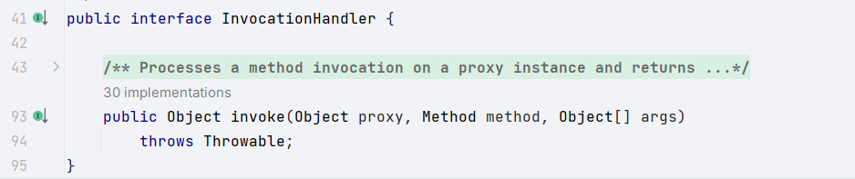
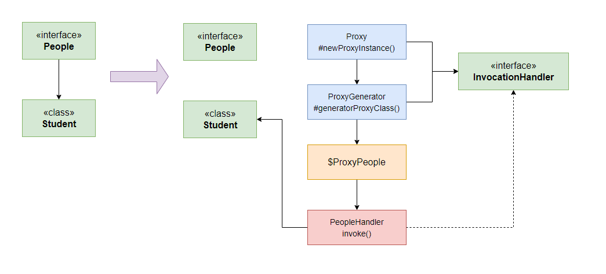
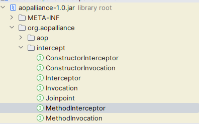
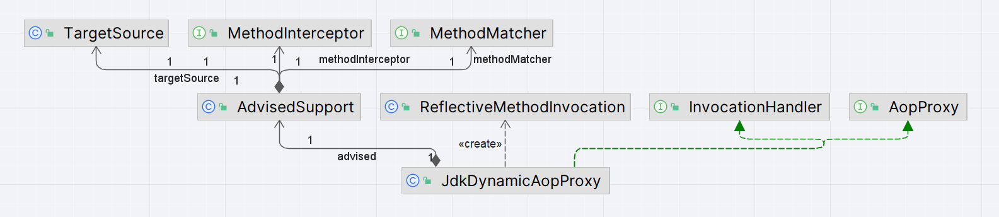
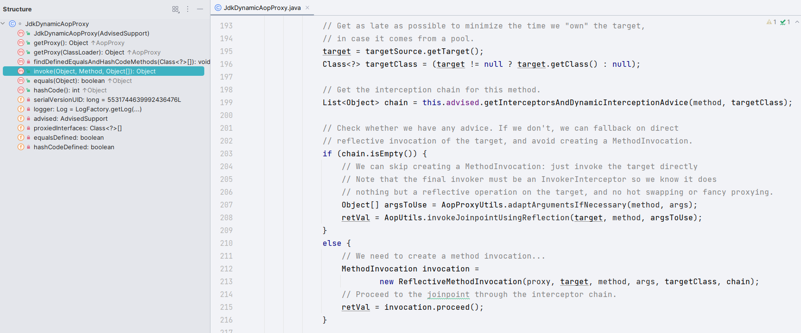

# Aop - JDK动态代理

> 当前文档对应Git分支：`14-jdk-dynamic-proxy`

在上一章节中提到了Aop实现的核心就是代理技术，通过代理技术生成一个**代理增强类**，它增强了原有的业务类代码，并且是在不修改原有业务代码的情况下执行的。

## 动态代理

关于动态代理技术，我们在之前IOC阶段已经学习过了：[Bean实例化策略（JDK和Cglib动态代理）](../../ioc/02-bean-instance-strategy/README.md)，
这里我们再通过代码分析一下:

首先我们知道JDK动态代理技术的核心是 `Proxy.newProxyInstance()`方法；
而具体生成代理类class文件的是`ProxyGenerator.generateProxyClass()`方法，它会返回代理类二进制byte数组，
因此我们直接调用此方法生成代理类的class文件:

```java
public interface People {
    void say();
}

@Test
public void t1() throws Exception {
    byte[] bytes = ProxyGenerator.generateProxyClass("$ProxyPeople", new Class[]{People.class});
    String filePath = System.getProperty("user.dir") + "/target/$ProxyPeople.class";
    File file = new File(filePath);
    FileOutputStream outputStream = new FileOutputStream(file);
    outputStream.write(bytes);
    outputStream.close();
}
```

执行后会在项目`/target`目录下生成`$ProxyPeople.class`文件，看下文件内容：

```java
public final class $ProxyPeople extends Proxy implements People {
    public final void say() throws  {
        try {
            super.h.invoke(this, m3, (Object[])null);
        } catch (RuntimeException | Error var2) {
            throw var2;
        } catch (Throwable var3) {
            throw new UndeclaredThrowableException(var3);
        }
    }
    
    ...
}
```

省略了其他代码，可以得出两个结论：

> 1. JDK动态代理只能是基于接口的，不能是基于类的

可以看到，因为生成的代理类已经继承了`Proxy`类，根据Java的单继承多实现特性，它只能再实现一个或多个接口不能再继承类了；
因此：**JDK动态代理只能是基于类的，这也是再Spring Aop框架中，当被代理类是接口时就使用JDK动态代理**

> 2. 代理类增强的体现在`InvocationHandler`接口

原有`People`接口只有一个`say()`方法，可以发现代理类的`say()`方法是调用了`super.h.invoke()`，
也就是调用父类`Proxy`中的`h`变量，最终可以知道是调用了`InvocationHandler`接口的`invoke()`方法：



到此为止，我们能想象到，当一个类实现了`InvocationHandler`是不是就完成的了增强了呢？
在执行被代理类的函数时，首先会执行代理类对此函数重写后的函数，并且会调用`InvocationHandle`接口实现类的`invoke`函数；

那么就写一个实现了`InvocationHandler`接口的类看下：

```java
public class Student implements People {
    @Override
    public void say() {
        System.out.println("this is Student...");
    }
}

public class PeopleHandler implements InvocationHandler {
    private Object target;
    public PeopleHandler(Object target) {
        this.target = target;
    }

    @Override
    public Object invoke(Object proxy, Method method, Object[] args) throws Throwable {
        System.out.println("this is PeopleHandler...");
        return method.invoke(target, args);
    }
}
```

如上，按照我们的设想，当生成代理类的时候将`PeopleHandler`类也注入进去应该就会被执行：

```java
@Test
public void t2() {
    // 设置要增强的InvocationHandler
    InvocationHandler invocationHandler = new PeopleHandler(new Student());
    // 生成代理类
    People people = (People) Proxy.newProxyInstance(getClass().getClassLoader(), new Class[]{People.class}, invocationHandler);
    people.say();
}
```

执行结果：

```java
this is PeopleHandler...
this is Student...
```

流程图如下：




## Spring Aop 

看了上面的介绍，我们知道Jdk 动态代理增强的原理是`InvocationHandler`接口的`invoke()`方法，借助这个函数可以实现很多定制化功能。

结合Aop的设计思想，我们最终目的是通过横切的方式在任意切入点织入一些代码以实现业务增强；而在Spring中用切面增强一个类的方式就是：**拦截**，
通过拦截方法的执行，去添加一个额外的逻辑。

### 拦截器实现

在Aop标准接口中，拦截器有一个专门的接口：`MethodInterceptor`：



拦截器也是Aop的一种增强业务代码的方式，因此只要在生成代理类的同时调用`InvocationHandler`接口的`invoke()`函数织入拦截器即可。

我们先看下本次新增的接口类：



- TargetSource: 包装了当前Aop调用的目标对象
- MethodMatcher: 方法层面检查切入点函数是否符合
- MethodInterceptor: Aop标准方法拦截器接口
- AdvisedSupport: Aop代理配置管理器的基类，包含了上面所需的三个对象
- ReflectiveMethodInvocation: Spring对Aop标准接口MethodInvocation的实现，用于构建拦截器链
- InvocationHandler: Jdk动态代理增强的核心接口
- AopProxy: Spring中创建代理对象的顶层接口，其中包含了Jdk和Cglib代理实现类
- JdkDynamicAopProxy: Spring Aop中对JDK动态代理具体实现


TargetSource

```java
public class TargetSource {

    private final Object target;

    public TargetSource(Object target) {
        this.target = target;
    }

    public Class<?>[] getTargetClass() {
        return this.target.getClass().getInterfaces();
    }

    public Object getTarget() {
        return this.target;
    }
}
```

AdvisedSupport

```java
public class AdvisedSupport {

    /**
     * 代理的目标对象
     */
    private TargetSource targetSource;

    /**
     * 方法拦截器
     */
    private MethodInterceptor methodInterceptor;

    /**
     * 方法匹配器
     */
    private MethodMatcher methodMatcher;
 
    // getter/setter
    ...
}
```

ReflectiveMethodInvocation

```java
public class ReflectiveMethodInvocation implements MethodInvocation {

    private final Object target;
    private final Method method;
    private final Object[] arguments;

    public ReflectiveMethodInvocation(Object target, Method method, Object[] arguments) {
        this.target = target;
        this.method = method;
        this.arguments = arguments;
    }

    @Override
    public Method getMethod() {
        return method;
    }

    @Override
    public Object[] getArguments() {
        return arguments;
    }

    @Override
    public Object proceed() throws Throwable {
        return method.invoke(target, arguments);
    }

    @Override
    public Object getThis() {
        return target;
    }

    @Override
    public AccessibleObject getStaticPart() {
        return method;
    }
}
```

JdkDynamicAopProxy

```java
public interface AopProxy {

    /**
     * 创建一个新的代理对象
     */
    Object getProxy();
}

public class JdkDynamicAopProxy implements AopProxy, InvocationHandler {

    private final AdvisedSupport advised;

    public JdkDynamicAopProxy(AdvisedSupport advised) {
        this.advised = advised;
    }

    @Override
    public Object getProxy() {
        return Proxy.newProxyInstance(getClass().getClassLoader(), advised.getTargetSource().getTargetClass(), this);
    }

    @Override
    public Object invoke(Object proxy, Method method, Object[] args) throws Throwable {
        // 拿到被代理的目标对象
        Object target = advised.getTargetSource().getTarget();
        // 检查当前方法是否匹配此目标对象
        if (advised.getMethodMatcher().matches(method, target.getClass())) {
            // 获取拦截器
            MethodInterceptor methodInterceptor = advised.getMethodInterceptor();
            // 构建拦截器链，执行拦截器
            return methodInterceptor.invoke(new ReflectiveMethodInvocation(target, method, args));
        }
        return method.invoke(target, args);
    }
}
```

如上，Spring Aop实现JDK动态代理的核心是`JdkDynamicAopProxy`类，它实现了`InvocationHandler`接口，并且重写`invoke()`方法，
在其中检查切入点函数是否匹配目标函数，匹配就构建并执行对应的过滤器链；

**注意：** 在Spring源码中，`JdkDynamicAopProxy`的`invoke`大概流程也是检查是否有对应的过滤器链，有就执行（我们这里简化了代码，如果切入点函数匹配就执行过滤器链）



## 测试

```java
public interface People {
    void say();
}

public class Student implements People {
    @Override
    public void say() {
        System.out.println("this is Student...");
    }
}

@Test
public void t3() {
    People people = new Student();

    // 被代理的目标对象
    TargetSource targetSource = new TargetSource(people);
    // 自定义的拦截器
    PeopleInterceptor interceptor = new PeopleInterceptor();
    // 生成AspectJ的切点Pointcut，获取一个方法匹配器
    MethodMatcher methodMatcher = new AspectJExpressionPointcut("execution( * cn.tycoding.spring.aop.proxy.People.say(..))").getMethodMatcher();

    AdvisedSupport advisedSupport = new AdvisedSupport();
    advisedSupport.setTargetSource(targetSource);
    advisedSupport.setMethodInterceptor(interceptor);
    advisedSupport.setMethodMatcher(methodMatcher);

    People proxy = (People) new JdkDynamicAopProxy(advisedSupport).getProxy();
    proxy.say();
}
```

执行结果

```java
before MethodInterceptor invoke ...
this is Student...
after MethodInterceptor invoke...
```