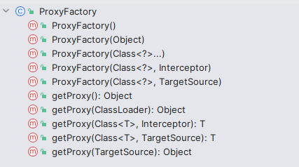

# Aop代理工厂实现

> 当前文档对应Git分支：`16-proxy-factory`

何为代理工厂，顾名思义就是生成代理的工厂；在前面我们知道Spring中既使用了JDK动态代理又使用了Cglib动态代理，那么Spring使用什么策略去判断是使用Jdk还是Cglib代理呢？

## 源码分析

首先定位到ProxyFactory对象中：



可以看到核心就围绕如何获取代理即`getProxy()`方法：


其调用了父类`ProxyCreatorSupport`的`createAopProxy()`方法：


最终是调用`AopProxyFactory`接口的`createAopProxy()`方法：


而`AopProxyFactory`接口的唯一实现是`DefaultAopProxyFactory`类：


到此为止，Spring Aop生成代理的策略就是`DefaultAopProxyFactory`的实现，如上其实是根据几种判断条件决定是使用JDK代理还是Cglib代理：

- `config.isProxyTargetClass()`: 显示配置是否使用cglib代理，这个配置可追溯`ProxyConfig`类的`proxyTargetClass`属性，默认为false；
- `targetClass.isInterface()`: 目标对象是否是一个接口，是就使用Jdk代理
- `Proxy.isProxyClass()`: 目标对象是否是Proxy的子类，是就使用Jdk代理

其他情况使用Cglib代理

## 实践

首先在`AdvisedSupport`中增加一个`proxyTargetClass`属性表示是否使用cglib代理，默认为false；

**注意：** 在Spring源码中，此属性在`ProxyConfig`中定义，并且在Spring中此选项是可以在配置文件配置的；

```java
public class AdvisedSupport {

    /**
     * 是否使用cglib代理，默认为false
     */
    private boolean proxyTargetClass = false;

    ...    
}
```

ProxyFactory

```java
public class ProxyFactory {

    private AdvisedSupport advisedSupport;

    public ProxyFactory(AdvisedSupport advisedSupport) {
        this.advisedSupport = advisedSupport;
    }

    public Object getProxy() {
        return createAopProxy().getProxy();
    }

    /**
     * 创建Aop代理：Jdk动态代理或者Cglib动态代理
     * 在Spring源码中默认关闭cglib代理，而具体生成代理的策略取决于被代理类是什么
     * 具体查看Spring源码DefaultAopProxyFactory类
     * 当被代理类是接口时就会使用JDK动态代理
     */
    private AopProxy createAopProxy() {
        if (advisedSupport.isProxyTargetClass()) {
            return new CglibAopProxy(advisedSupport);
        }
        return new JdkDynamicAopProxy(advisedSupport);
    }
}
```

**注意：** 这里我们简化了代码实现，不再做过多判断


