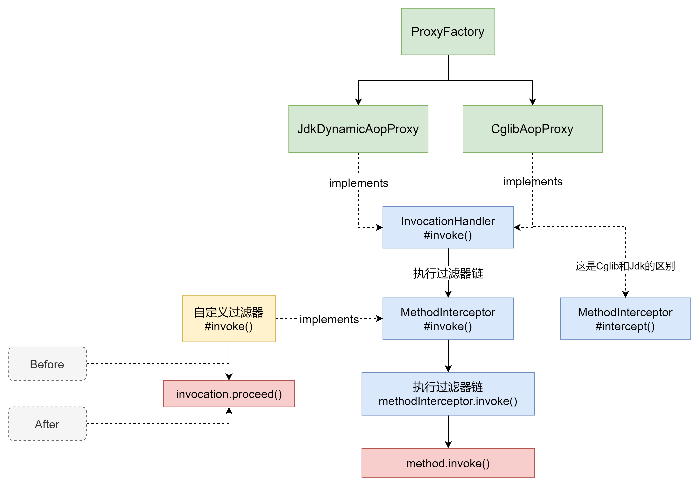
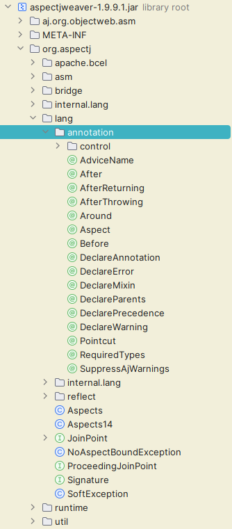
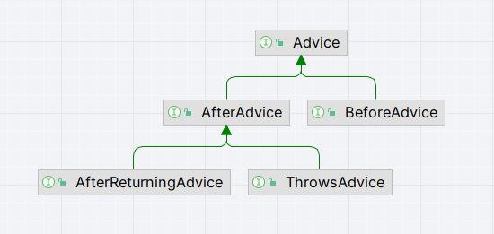
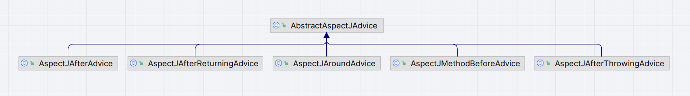

# Aop常见通知类型

> 当前文档对应Git分支：`17-aop-advice`

在之前 [Aop之JDK动态代理实现（拦截器实现）](../14-jdk-dynamic-proxy/README.md) 章节中，
我们知道在Spring Aop中，**对切面实现增强的一种方式就是实现拦截器，在方法执行的前后拦截以实现增强**；

## 回顾

> Spring Aop增强的核心

对于JDK动态代理，JDK生成的代理类继承了Proxy类，并且会对原有业务类的函数重新包装，
会先调用`InvocationHandler`接口的`invoke()`方法，因此只要在这里做增强即可（Cglib是调用`MethodInterceptor`的`intercept()`方法，也是类似思路）。

> 拦截器实现的核心

基于上面的思路，只需要在JDK或Cglib生成代理类的同时触发对应的拦截器即可。

**注意：** 

- `InvocationHandler`接口默认触发`invoke()`函数；其中`method.invoke()`回调函数来自反射类Method，表示继续执行此方法;
- `MethodInvocation`接口默认触发`intercept()`函数；其中`proceed()`方法表示继续执行下一个过滤器（是Aop的标准接口）;

再整体看一下代理和自定义过滤器的关系流程图：



如上图已经指出了Before和After等自定义过滤器所在的位置

## 源码分析

之前我们有提到过Spring Aop和AspectJ的关系：

- 无关性：如果不使用@Before、@After等注解，Spring Aop和AspectJ是没有关系的，此时Spring Aop使用自己的代理实现切面
- 有关性：@Before等注解来自AspectJ，因此此时两者就有了关系；（不过Spring对AspectJ的注解做了单独的实现，并没有完全使用AspectJ）



Spring封装的Advice接口：



Spring对AspectJ通知接口的抽象封装：



因此我们知道了Spring虽然使用了AspectJ的注解，但是对于注解的实现Spring有单独的处理，
并且在Spring Aop中，上述注解应该被Spring IOC容器扫描到并装配到IOC容器中，
除此之外，Spring还提供了@Aspect注解，用此注解标记的类才会被Spring IOC扫描到。

## 实现

> Tips: 这里我只做了Before前置通知和After后置通知，Around环绕通知其实类似，就是方法执行前后都调用

定义各种通知接口：

```java
public interface BeforeAdvice extends Advice {
}

public interface MethodBeforeAdvice extends BeforeAdvice {

    /**
     * 调用方法之前的回调
     *
     * @param method 被调用的方法
     * @param args   方法的参数
     * @param target 被调用的目标
     */
    void before(Method method, Object[] args, Object target) throws Throwable;
}

public interface AfterAdvice extends Advice {
}

public interface AfterReturningAdvice extends AfterAdvice {

    /**
     * 给定方法返回后的回调
     *
     * @param method 被调用的方法
     * @param args   方法的参数
     * @param target 被调用的目标
     */
    void afterRetuning(Method method, Object[] args, Object target) throws Throwable;
}
```

MethodBeforeAdviceInterceptor

```java
public class MethodBeforeAdviceInterceptor implements MethodInterceptor {

    private MethodBeforeAdvice advice;

    public MethodBeforeAdviceInterceptor(MethodBeforeAdvice advice) {
        this.advice = advice;
    }

    @Override
    public Object invoke(MethodInvocation invocation) throws Throwable {
        advice.before(invocation.getMethod(), invocation.getArguments(), invocation.getThis());
        return invocation.proceed();
    }
}
```

AfterReturningAdviceInterceptor

```java
public class AfterReturningAdviceInterceptor implements MethodInterceptor {

    private AfterReturningAdvice advice;

    public AfterReturningAdviceInterceptor(AfterReturningAdvice advice) {
        this.advice = advice;
    }

    @Override
    public Object invoke(MethodInvocation invocation) throws Throwable {
        Object proceed = invocation.proceed();
        // 等待函数执行后再执行后置拦截器
        advice.afterRetuning(invocation.getMethod(), invocation.getArguments(), invocation.getThis());
        return proceed;
    }
}
```

## 测试

```java
public class PeopleBeforeAdvice implements MethodBeforeAdvice {

    @Override
    public void before(Method method, Object[] args, Object target) throws Throwable {
        System.out.println("people method run before...");
    }
}

public class PeopleAfterAdvice implements AfterReturningAdvice {

    @Override
    public void afterRetuning(Method method, Object[] args, Object target) throws Throwable {
        System.out.println("people method run after...");
    }
}
```

```java
public class AdviceTest {

    @Test
    public void t1() {
        People people = new Student();

        // 被代理的目标对象
        TargetSource targetSource = new TargetSource(people);

        // 前置拦截器
//        MethodBeforeAdviceInterceptor interceptor = new MethodBeforeAdviceInterceptor(new PeopleBeforeAdvice());
        // 后置拦截器
        AfterReturningAdviceInterceptor interceptor = new AfterReturningAdviceInterceptor(new PeopleAfterAdvice());

        // 生成AspectJ的切点Pointcut，获取一个方法匹配器
        MethodMatcher methodMatcher = new AspectJExpressionPointcut("execution( * cn.tycoding.spring.aop.proxy.People.say(..))").getMethodMatcher();

        AdvisedSupport advisedSupport = new AdvisedSupport();
        advisedSupport.setTargetSource(targetSource);
        advisedSupport.setMethodInterceptor(interceptor);
        advisedSupport.setMethodMatcher(methodMatcher);

        People proxy = (People) new CglibAopProxy(advisedSupport).getProxy();
        proxy.say();
    }
}
```


