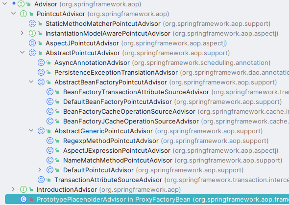
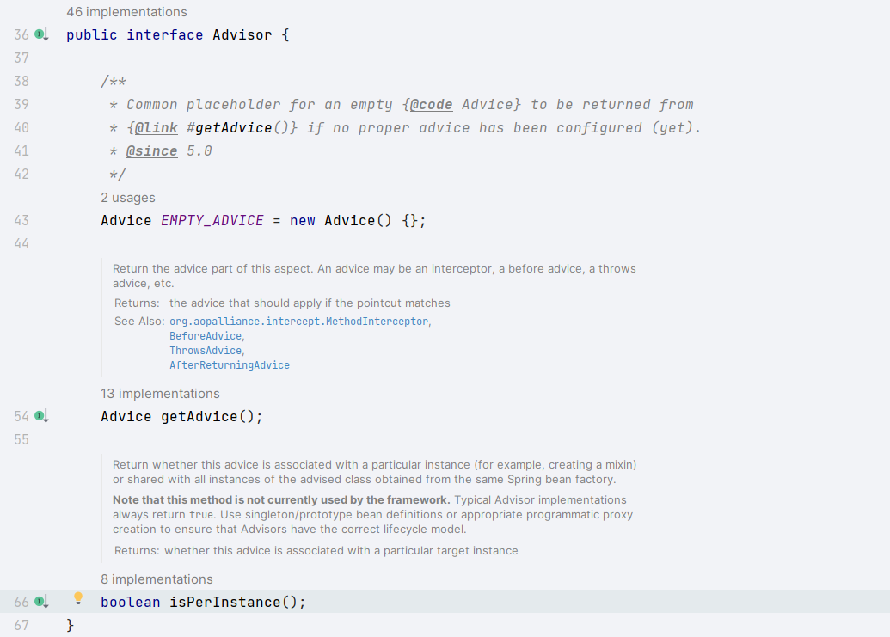

# Aop之切面Advisor

> 当前文档对应Git分支：`18-aop-advisor`

## 回顾

### Pointcut

在之前 [AspectJ切面表达式](../13-aspectj-expression/README.md) 章节中我们学习了如何使用AspectJ的切点表达式构建切点，
主要讲了根据String类型切点表达式构建切点（再交由AspectJ的表达式解析器去解析语法），其中关注了两个对象：`ClassFilter`和`MathodMatcher`接口，
这两个接口都是为了根据表达式的切点判断切点**切**的是哪个类下的哪些方法；

因此上述都是围绕切点Pointcut接口的开发

### Advice

在之前 [Aop之通知类型](../17-aop-advice/README.md) 章节我们实现了两个常见的通知类型：Before前置通知和After后置通知；

其实现的核心就是基于**拦截器**实现，实现核心在于使用JDK或Cglib构建Aop代理对象自动执行了`InvocationHandler`的`invoke()`函数，在`invoke()`中我们又主动执行了对应的拦截器`MethodInterceptor`。

因此Aop的通知Advice其实就是一种拦截器，在函数执行前后进行自定义通知。

## Advisor 

上面介绍了切点Pointcut和通知Advice，接着就是介绍**切面Advisor**。

**切面Advisor = 切点Pointcut + 通知Advice**

因此，我们可以粗略的认为切面Advisor就是一个包含了Pointcut和Advice的对象，Advisor在两者基础上做了增强。

在Spring源码中这块的处理比较复杂，在这里先不做过多探究了：



Advisor接口在Spring源码中也很简单：




## 实现

Advisor接口

```java
public interface Advisor {
    Advice getAdvice();
}

public interface PointcutAdvisor extends Advisor {
    Pointcut getPointcut();
}
```

AspectJExpressionPointcutAdvisor

```java
public class AspectJExpressionPointcutAdvisor implements PointcutAdvisor {

    private AspectJExpressionPointcut pointcut;

    private Advice advice;

    private String expression;

    public void setExpression(String expression) {
        this.expression = expression;
        pointcut = new AspectJExpressionPointcut(expression);
    }

    public void setAdvice(Advice advice) {
        this.advice = advice;
    }

    @Override
    public Advice getAdvice() {
        return advice;
    }

    @Override
    public Pointcut getPointcut() {
        return pointcut;
    }
}
```

## 测试

```java
    @Test
    public void t2() {
        People people = new Student();

        // 被代理的目标对象
        TargetSource targetSource = new TargetSource(people);

        // 后置拦截器
        AfterReturningAdviceInterceptor interceptor = new AfterReturningAdviceInterceptor(new PeopleAfterAdvice());

        // 定义一个切面Advisor=切点+通知
        AspectJExpressionPointcutAdvisor advisor = new AspectJExpressionPointcutAdvisor();
        advisor.setAdvice(interceptor);
        advisor.setExpression("execution( * cn.tycoding.spring.aop.proxy.People.say(..))");

        AdvisedSupport advisedSupport = new AdvisedSupport();
        advisedSupport.setTargetSource(targetSource);
        advisedSupport.setMethodInterceptor(interceptor);
        advisedSupport.setMethodMatcher(advisor.getPointcut().getMethodMatcher());

        People proxy = (People) new CglibAopProxy(advisedSupport).getProxy();
        proxy.say();
    }
```

