# Bean实例化策略（动态代理技术）

> 当前文档对应Git分支：`02-bean-instance-strategy`

在上一个分支 [01-bean-factory](../01-bean-factory/README.md) 中 `AbstractAutowireCapableBeanFactory` 对象负责Bean的创建操作，
当时采用了 `Class.newInstance()` 方法进行Bean实例化创建。

而在Spring源码中，Bean实例化策略接口 `InstantiationStrategy` 对应了两个实现类：

1. `SimpleInstantiationStrategy` 简单Bean实例方法，包含了使用Bean工厂实例化（反射）、使用构造函数实例化Bean；
2. `CglibSubclassingInstantiationStrategy` 使用Cglib实例化Bean，这是Spring默认的方式；

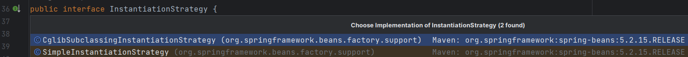

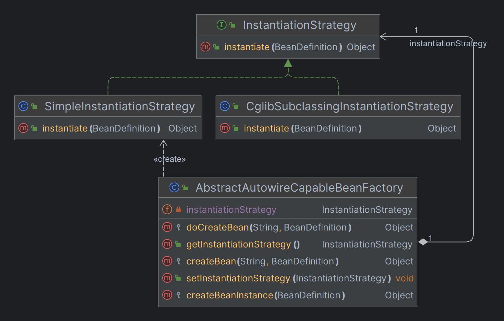

## SimpleInstantiationStrategy

在Spring源码中，`SimpleInstantiationStrategy` 提供了几种简单的实例化Bean的方式，例如使用：构造函数（有参/无参）、BeanFactory（利用反射）；

本例中，模拟了无参构造函数实例化Bean的方式，代码如下：

```java
@Override
public Object instantiate(BeanDefinition beanDefinition) throws BeansException {
    Class clazz = beanDefinition.getBeanClass();
    try {
        // 这里直接使用无参构造实例化
        Constructor constructor = clazz.getDeclaredConstructor();
        return constructor.newInstance();
    } catch (Exception e) {
        throw new BeansException("Failed to instantiate [" + clazz.getName() + "]", e);
    }
}
```

那么再看Spring源码中 `SimpleInstantiationStrategy` 如何实现的：

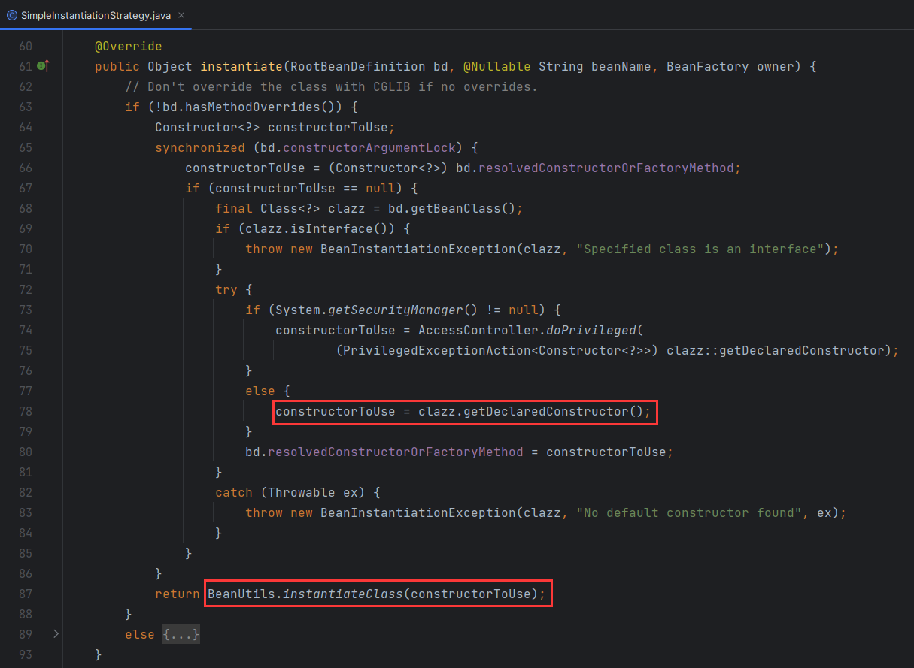

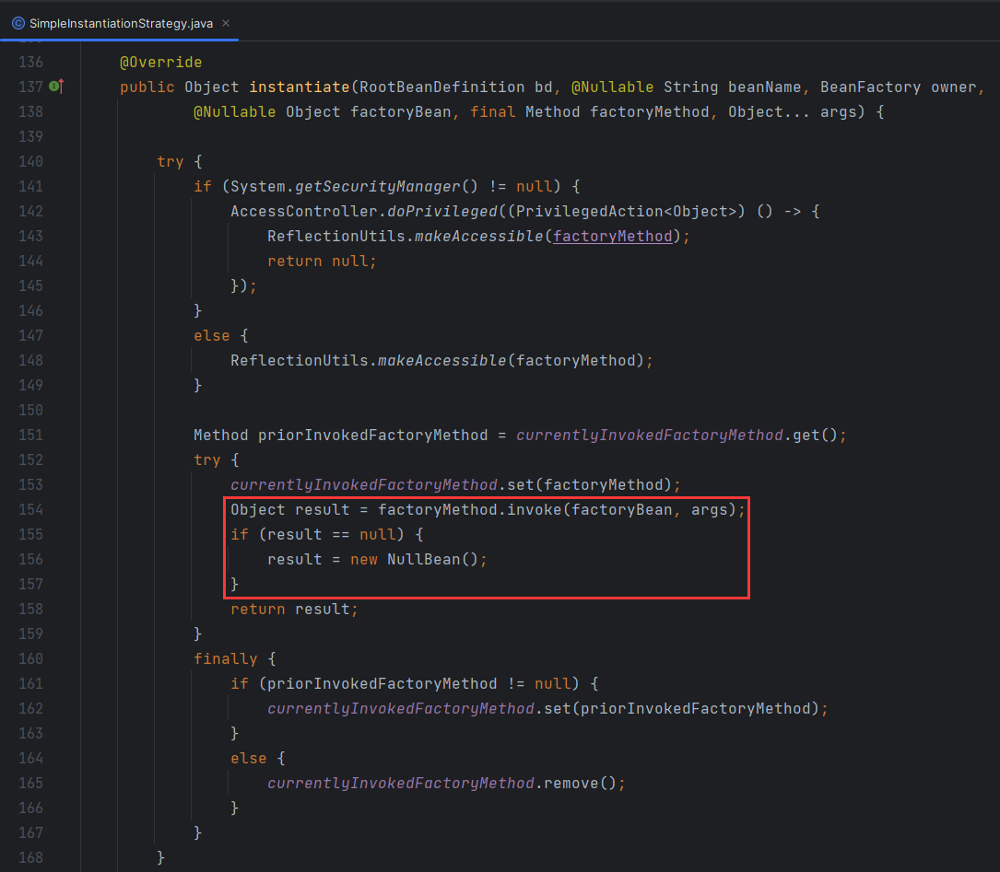


## 几种Bean实例化方式

```java
public class BeanInstanceTest {

    /**
     * 无参构造函数实例化Bean
     */
    @Test
    public void t1() throws InstantiationException, IllegalAccessException {
        BeanInstanceClazz instance = BeanInstanceClazz.class.newInstance();
        System.out.println(instance);
    }

    /**
     * 有参构造函数实例化Bean
     */
    @Test
    public void t2() throws NoSuchMethodException, InvocationTargetException, InstantiationException,
            IllegalAccessException {
        Class<BeanInstanceClazz> clazz = BeanInstanceClazz.class;
        Constructor<BeanInstanceClazz> constructor = clazz.getDeclaredConstructor(String.class);
        BeanInstanceClazz instance = constructor.newInstance("tycoding");
        System.out.println(instance.getName());
    }

    /**
     * 使用Cglib实例化Bean
     */
    @Test
    public void t3() {
        Enhancer enhancer = new Enhancer();
        enhancer.setSuperclass(BeanInstanceClazz.class);
        enhancer.setCallback((MethodInterceptor) (obj, method, args, proxy) -> proxy.invokeSuper(obj, args));
        Object instance = enhancer.create();
        System.out.println(instance);
    }
}

class BeanInstanceClazz {
    private String name;

    public BeanInstanceClazz() {
    }

    public BeanInstanceClazz(String name) {
        this.name = name;
    }

    public String getName() {
        return name;
    }
}
```

# 代理模式

Java的代理技术主要分为三类：
1. JDK静态代理 
2. JDK动态代理 
3. Cglib动态代理

核心：都是要通过代理类生成被代理类的对象引用，这样就可以实现调用代理类让代理类去调用具体的接口实现，代理类本身不提供服务。

优势：代理也是基于接口实现的，代理本身不提供服务而是通过Java多态方式调用具体的接口实现类完成业务处理，可以解决调用和实现类的解耦。

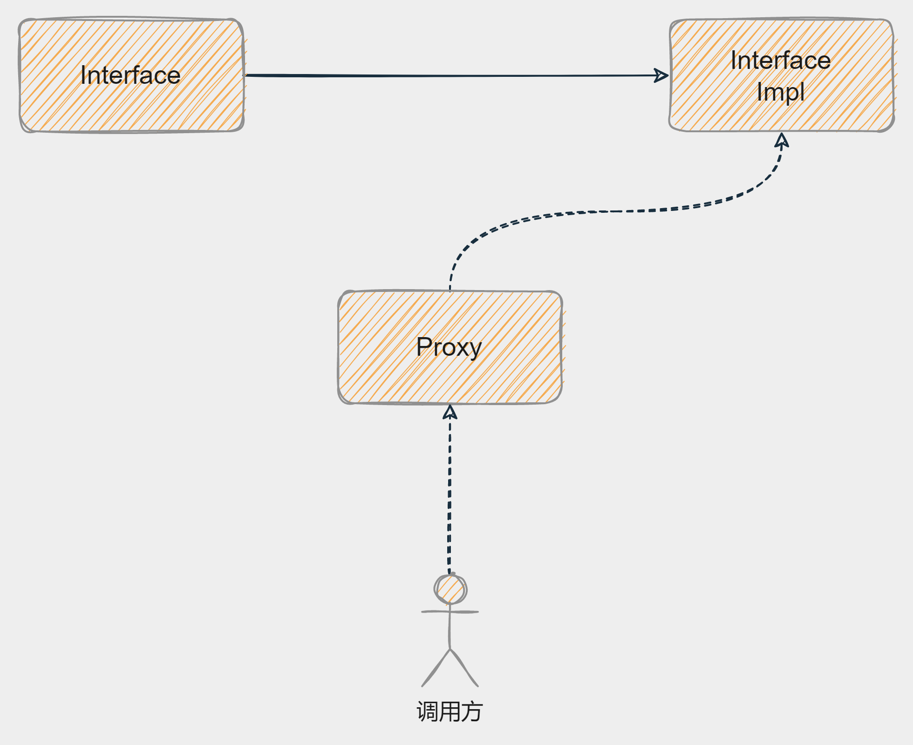


## JDK静态代理

`静态代理` 顾名思义，代理是提前写好的因此被称为静态。也就是代理类中已经定义好了接口实现类引用，测试代码如下：

```java
public class ProxyTest {

    /**
     * 测试JDK静态代理
     * JDK静态代理技术。逻辑：
     * 1.定义接口
     * 2.定义接口实现类（被代理类）
     * 3.定义代理类实现接口（包含被代理类的引用），调用被代理类的处理逻辑
     */
    @Test
    public void t1() {
        JdkStaticProxy proxy = new JdkStaticProxy();
        proxy.say();
    }
}

/**
 * JDK静态代理类。核心：实现代理接口，包含一个被代理类的对象引用，调用被代理类的处理逻辑
 */
class JdkStaticProxy implements ProxyTestInf {
    private ProxyTestInf inf = new ProxyTestInfImpl();

    @Override
    public void say() {
        inf.say();
    }
}

/**
 * 接口
 */
interface ProxyTestInf {
    void say();
}

/**
 * 被代理的类
 */
class ProxyTestInfImpl implements ProxyTestInf {

    @Override
    public void say() {
        System.out.println("this is ProxyTestInfImpl");
    }
}
```

如上，可以看到静态代理一个明显的缺点就是：

对每个接口实现类都要定义一个专属的代理类，这样将会使代码非常臃肿

## JDK动态代理

`动态代理` 顾名思义，代理类不是提前定义好的，而是在代码运行中动态生成的代理类，测试代码如下：

```java
public class ProxyTest {

    /**
     * 测试JDK动态代理
     */
    @Test
    public void t2() {
        ProxyTestInfImpl impl = new ProxyTestInfImpl();
        JdkDynamicProxy handler = new JdkDynamicProxy(impl);
        ProxyTestInf instance = (ProxyTestInf) Proxy.newProxyInstance(handler.getClass().getClassLoader(),
                impl.getClass().getInterfaces(), handler);
        System.out.println(instance);
        instance.say();
    }
}

/**
 * JDK动态代理类。核心：通过反射技术生成代理类
 */
class JdkDynamicProxy implements InvocationHandler {

    // 被代理类对象
    private Object obj;

    public JdkDynamicProxy(Object obj) {
        this.obj = obj;
    }

    @Override
    public Object invoke(Object proxy, Method method, Object[] args) throws Throwable {
        return method.invoke(obj, args);
    }
}
```

如上明显看到在动态代理中， `Proxy` 代理类中不用再定义每个实现类的引用，而是通过 `method.invoke()` 方法动态生成具体的代理类。

### 源码分析

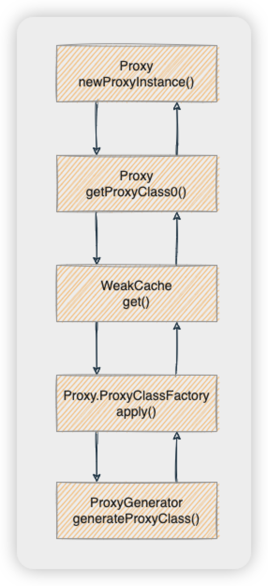

首先从 `Proxy.newProxyInstance()` 方法入口：

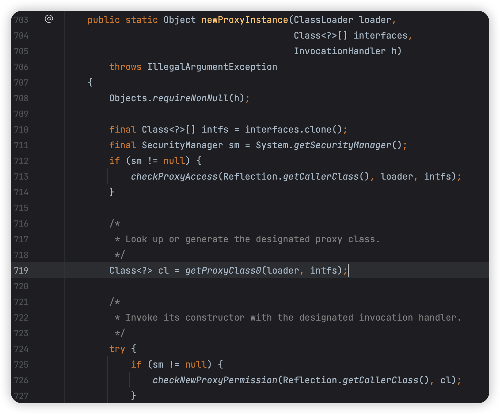

可以看到实际上是由 `getProxyClass0()` 方法生成的Class文件：

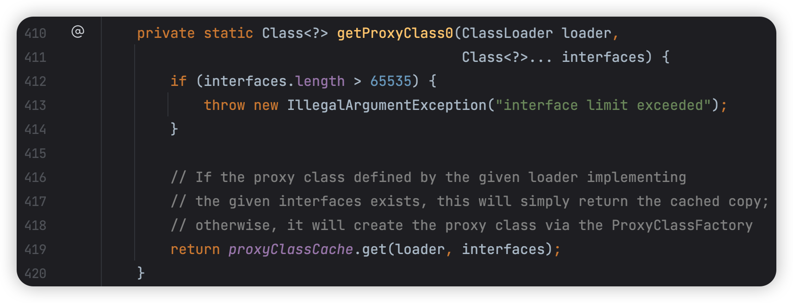

可以看到在 `proxyClassCache.get()` 上方的注释中写了：

如果给定接口实现类的代理类存在，就返回缓存副本，否则就调用 `ProxyClassFactory` 对象生成代理类

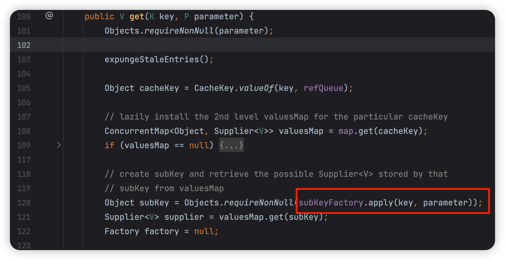

看到在Cache对象中，最终是调用Factory对象的 `apply`方法，再往下看apply接口的实现就追溯到了 `ProxyClassFactory` 对象。

接着往下看：

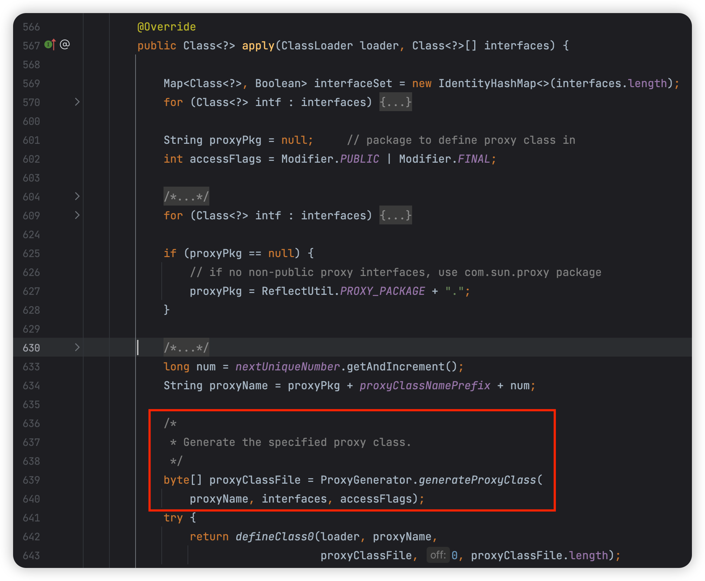

可以看到最终是调用 `ProxyGenerator.generateProxyClass()` 创建的代理类对象：

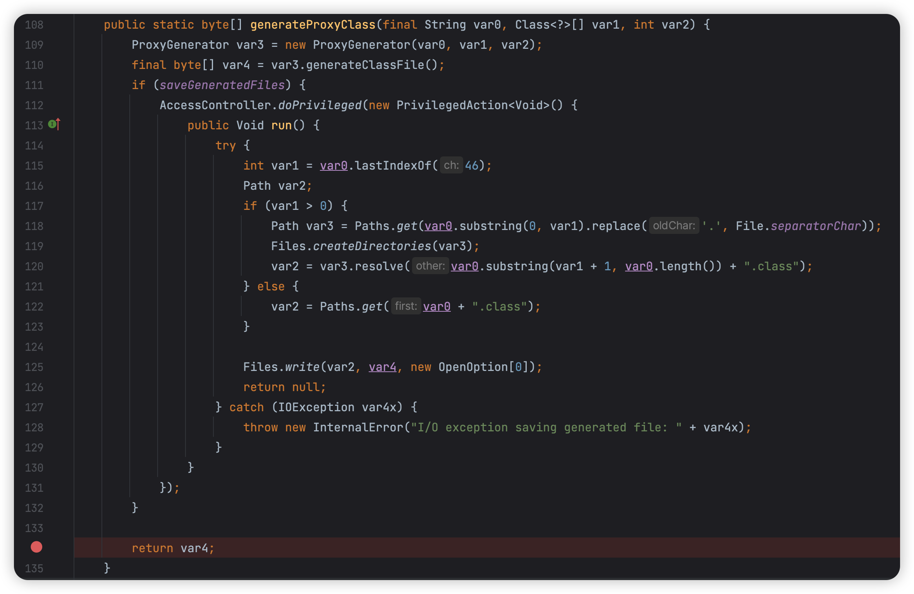

至此，动态代理创建的Class文件已经生成，下面我们Debug试一下

### Debug

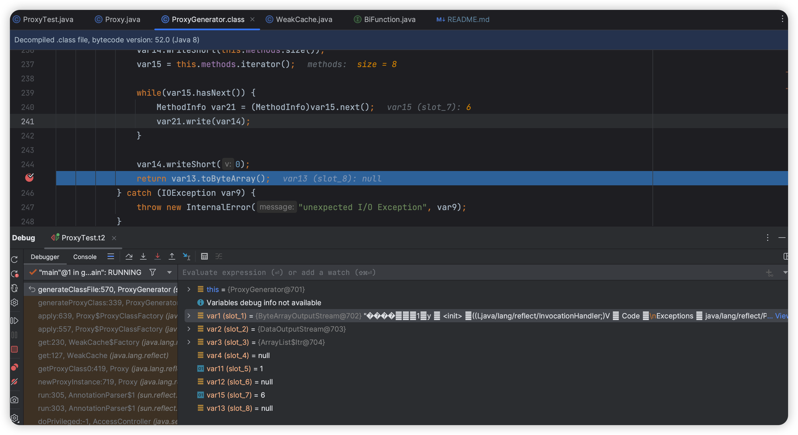

JDK动态代理实际上最终是通过 `ProxyGenerator` 对象动态生成的字节码文件。

通过Debug `ProxyGenerator` 对象可以看到大致的字节码信息（因为这里IDEA显示乱码，就不再看了），最终此方法返回的是动态代理类的二进制数组：

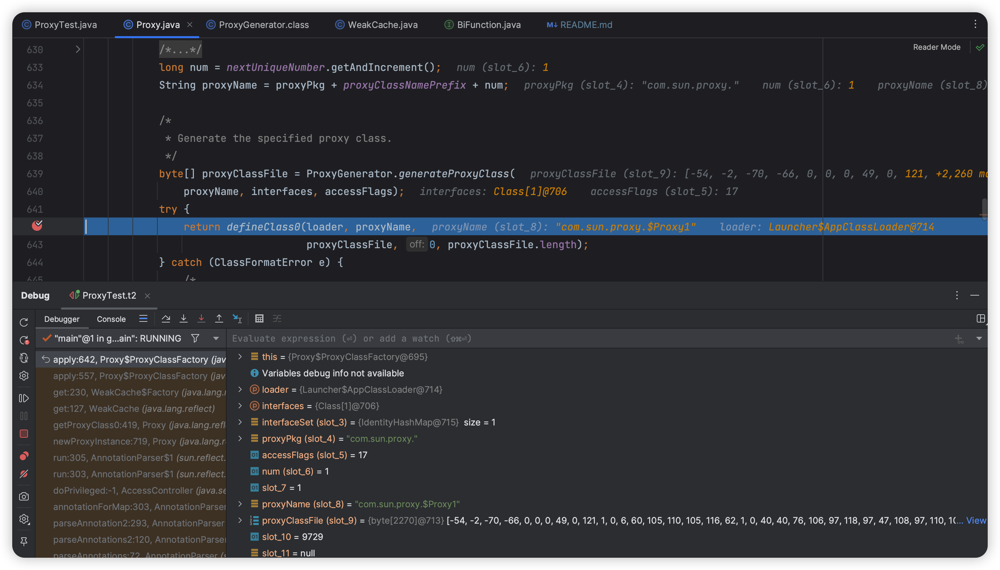

### 查看动态代理Class文件

通过分析上述源码，发现实际上可以直接调用 `ProxyGenerator` 类生成字节码文件的byte数组，然后再手动写入到Class文件中即可。

编写如下测试代码：

```java
/**
 * 查看JDK动态代理生成的字节码文件
 */
@Test
public void t3() throws Exception {
    byte[] bytes = ProxyGenerator.generateProxyClass("$ProxyTestInfImpl", new Class[]{ProxyTestInf.class});
    // 如果Windows系统此路径不在项目target目录下，将 "/target/" 修改为 "//target//"
    String filePath = System.getProperty("user.dir") + "/target/$ProxyTestInfImpl.class";
    File file = new File(filePath);
    FileOutputStream outputStream = new FileOutputStream(file);
    outputStream.write(bytes);
    outputStream.flush();
    outputStream.close();
}
```

运行后可以在项目根目录target文件夹下找到 `$ProxyTestInfImpl.class` 这个文件：

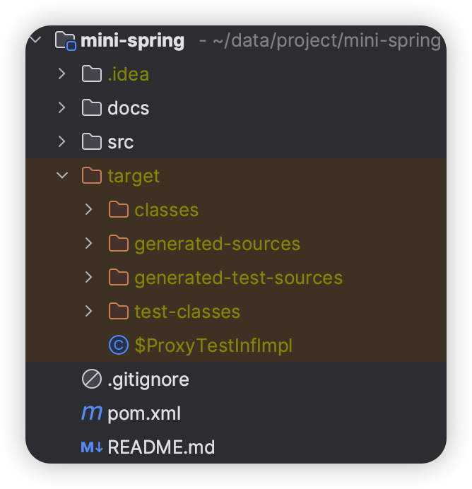

在IDEA中双击即可反编译这个Class文件：

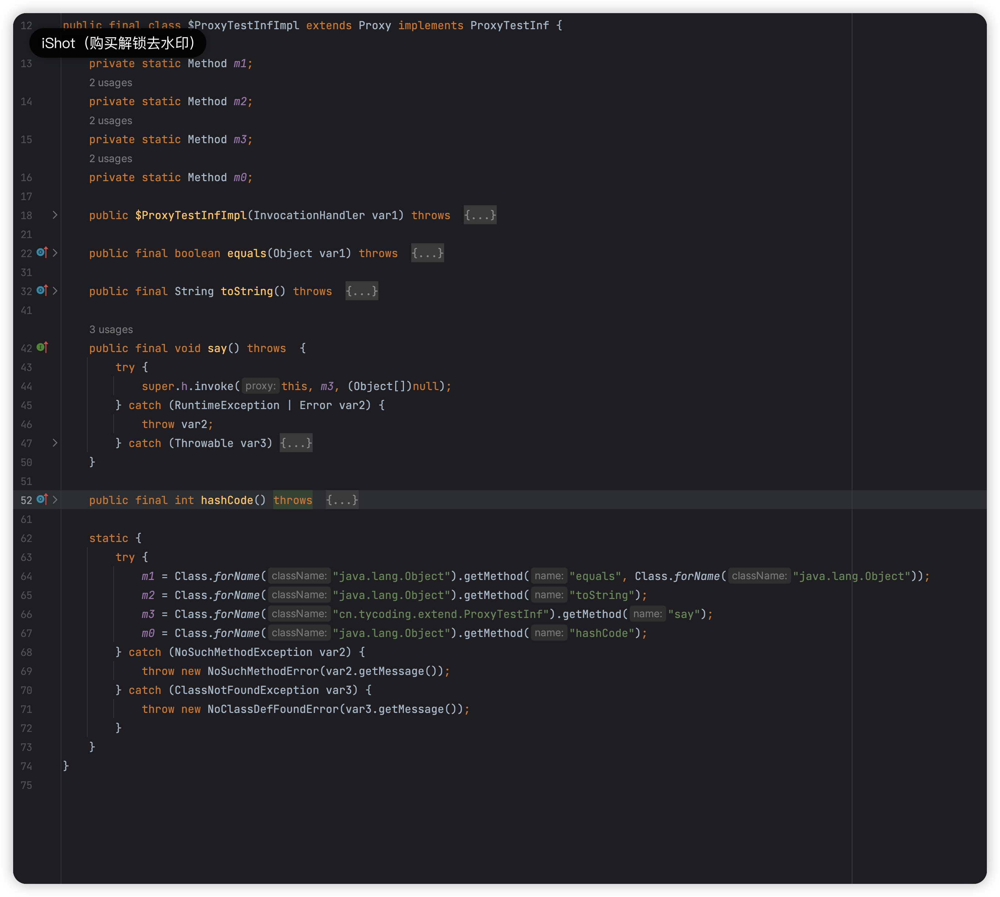

可以看到，通过JDK动态代理生成的代理类有如下特点：

1. 继承Proxy类，并且实现了指定的代理接口
2. 实现了代理接口中的函数
3. 代理类中的函数并不处理具体逻辑，而是通过 `InvocationHandler.invoke()` 调用具体实现类的函数处理

## Cglib动态代理

上面分析了JDK的动态代理设计，Cglib的设计思路也类似，下面先看测试方法：

```java
/**
 * Cglib动态代理，测试实现了接口的类
 */
@Test
public void t4() {
    Enhancer enhancer = new Enhancer();
    enhancer.setSuperclass(ProxyTestInfImpl.class);
    enhancer.setCallback((MethodInterceptor) (obj, method, args, proxy) -> proxy.invokeSuper(obj, args));
    ProxyTestInfImpl impl = (ProxyTestInfImpl) enhancer.create();
    impl.say();
}
```

同样，我们以 `ProxyTestInfImpl` 作为被代理类。

可以看到生成代理类的核心是 `proxy.invokeSuper()` 方法（`create()`方法是用来构建Class对象信息），Debug查看源码：

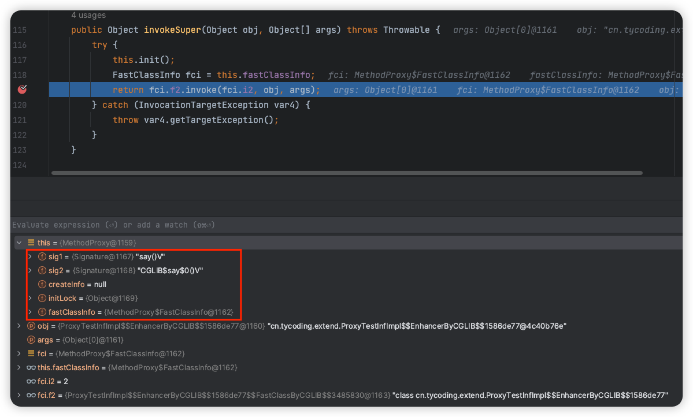

从源码上看，并没有JDK动态代理那样复杂的逻辑，但是可以明显的看到，在sig变量中存储了`say()`这个方法，

其实这是因为Cglib的 `FashClassInfo` 对象对Class做了特殊处理，直接存储了代理类的方法引用，因此无需再通过反射技术生成代理方法。

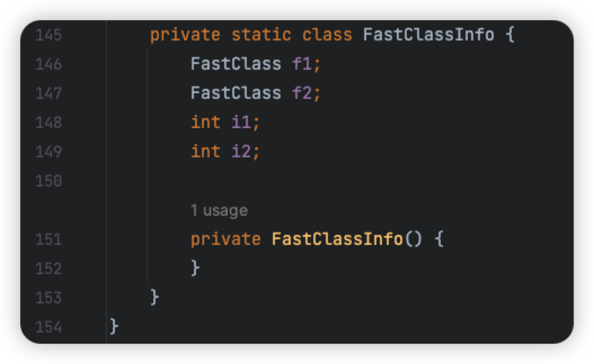

特别的是，Cglib并不要求被代理类必须实现接口（JDK动态代理是严格要求要实现接口的），下面增加测试方法：

```java
public class ProxyTest {
    /**
     * Cglib动态代理，测试未实现任何接口的类
     */
    @Test
    public void t5() {
        Enhancer enhancer = new Enhancer();
        enhancer.setSuperclass(CglibProxy.class);
        enhancer.setCallback((MethodInterceptor) (obj, method, args, proxy) -> proxy.invokeSuper(obj, args));
        CglibProxy impl = (CglibProxy) enhancer.create();
        impl.say1();
        impl.say2();
    }
}

class CglibProxy {
    public void say1() {
        System.out.println("this CglibProxy say1()");
    }
    public void say2() {
        System.out.println("this CglibProxy say2()");
    }
}
```

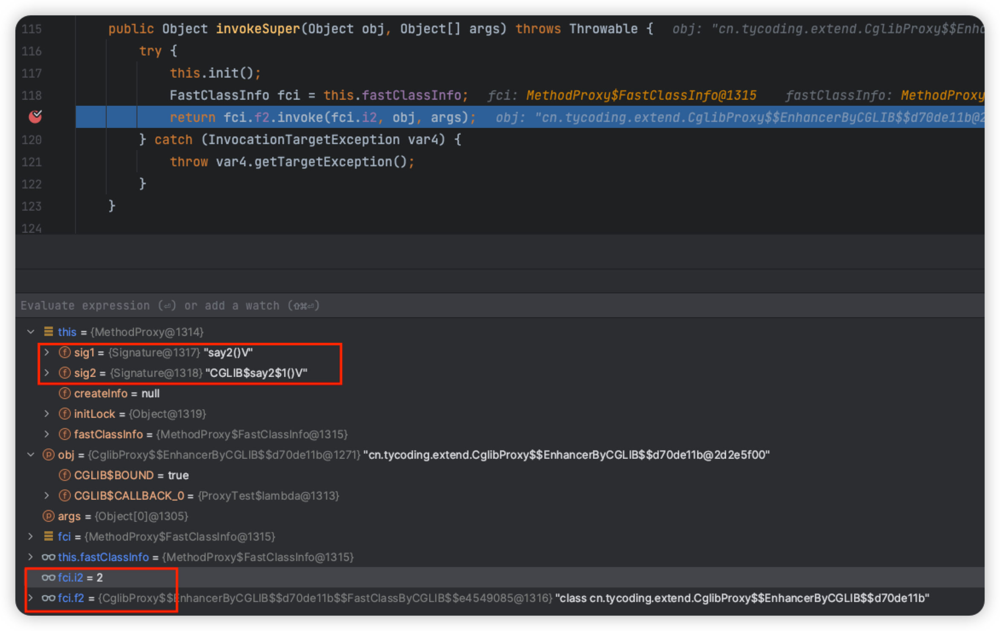

可以看到，当被代理类中出现多个函数的时候，此断点会重复进入并且sig也会随之改变。

因此可以明白，Cglib的FastClassInfo对Class做了特殊处理，将函数信息存放在类似数组的变量中，然后从数组中拿到具体某个函数的引用

