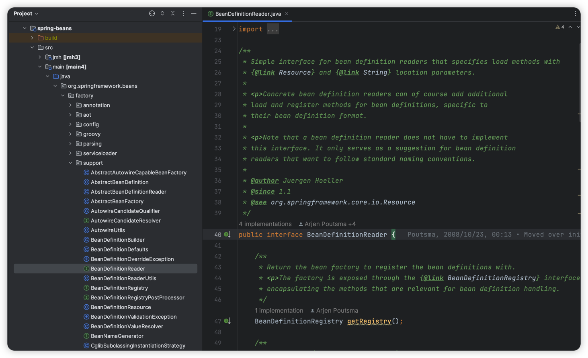
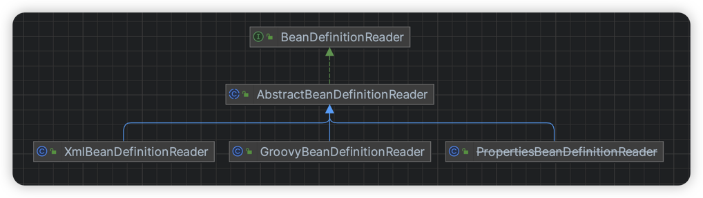
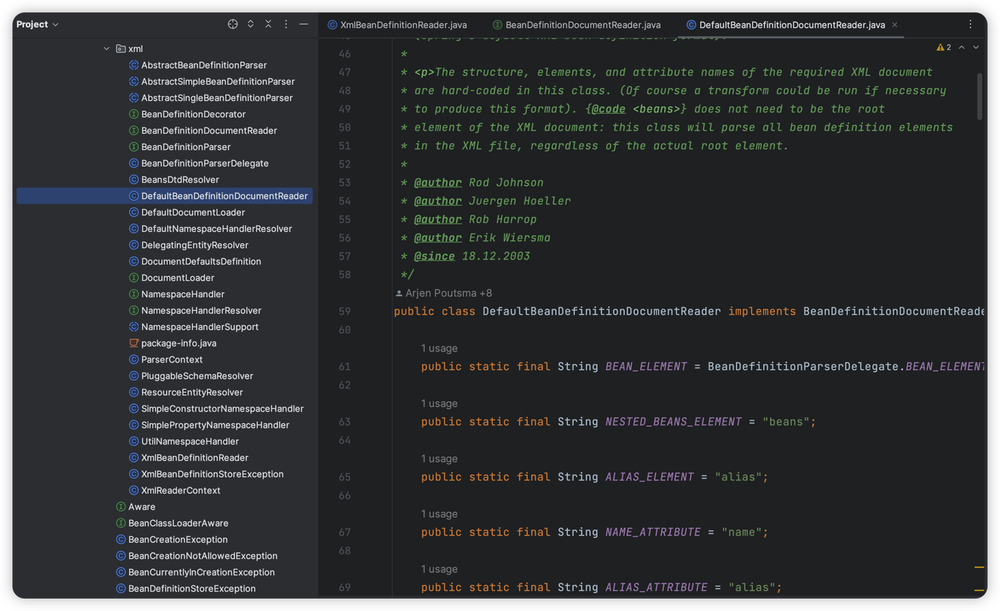
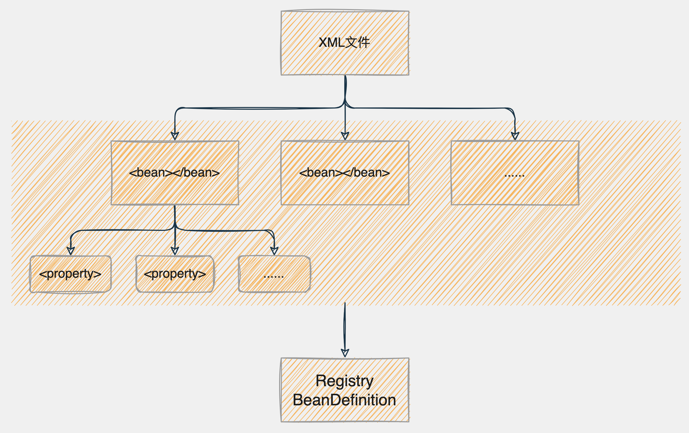

# XML文件装配Bean

> 当前文档对应Git分支：`05-xml-bean-definition`

在学习了 [填充Bean属性信息](../03-bean-property-value/README.md) 和 [资源加载器](../04-resource-loader/README.md) 
章节后，逐渐可以想到，思路是想：


也就是到目前位置，我们缺少解析Resource文件装配Bean属性的过程。

看Spring源码`BeanDefinitionRegistry`同目录下有这么一个类：`BeanDefinitionReader`



顾名思义，从注释中也能看出来，这是BeanDefinition的阅读器，负责从Resource接口中读取资源文件并装配BeanDefinition。

那么看下这个接口的实现类：



可以看到Spring提供的几种装配BeanDefinition的方式：
1. 根据XML文件装配BeanDefinition
2. 根据Groovy语法定义装配BeanDefinition
3. 根据Properties文件装配BeanDefinition

在学习SpringMVC的阶段（Struts框架），我们经常使用XML文件定义Bean，
因此在本项目中仅实现`XMLBeanDefinitionReader`。

## BeanDefinitionReader

```java
public interface BeanDefinitionReader {

    /**
     * 获取BeanDefinition对象注册的接口
     *
     * @return 返回注册对象
     */
    BeanDefinitionRegistry getRegistry();

    /**
     * 获取资源加载策略
     *
     * @return 返回匹配的策略实现类
     */
    ResourceLoader getResourceLoader();

    /**
     * 从指定位置加载BeanDefinition
     *
     * @param location 位置路径
     * @throws BeansException
     */
    void loadBeanDefinitions(String location) throws BeansException;

    /**
     * 从指定资源加载BeanDefinition
     *
     * @param resource 资源接口
     * @throws BeansException
     */
    void loadBeanDefinitions(Resource resource) throws BeansException;

    /**
     * 从多个位置加载BeanDefinition
     *
     * @param locations 位置路径集合
     * @throws BeansException
     */
    void loadBeanDefinitions(String[] locations) throws BeansException;
}
```

这个接口主要围绕两个功能实现：
1. 拿到Resource资源解析器实现，解析XML文件内容
2. 定义BeanDefinition读取器，读取XML文件中的BeanDefinition信息
3. 拿到BeanDefinitionRegistry，注册装配好的BeanDefinition

## AbstractBeanDefinitionReader

`AbstractBeanDefinitionReader` 是`BeanDefinitionReader`接口的抽象实现，定义基础的抽象方法，子类基于此类再进行扩展实现。

```java
public abstract class AbstractBeanDefinitionReader implements BeanDefinitionReader {

    private final BeanDefinitionRegistry registry;
    private ResourceLoader resourceLoader;

    public AbstractBeanDefinitionReader(BeanDefinitionRegistry registry) {
        this(registry, new DefaultResourceLoader());
    }

    public AbstractBeanDefinitionReader(BeanDefinitionRegistry registry, ResourceLoader resourceLoader) {
        this.registry = registry;
        this.resourceLoader = resourceLoader;
    }

    @Override
    public BeanDefinitionRegistry getRegistry() {
        return registry;
    }

    @Override
    public ResourceLoader getResourceLoader() {
        return resourceLoader;
    }

    @Override
    public void loadBeanDefinitions(String[] locations) throws BeansException {
        for (String location : locations) {
            loadBeanDefinitions(location);
        }
    }

    public void setResourceLoader(ResourceLoader resourceLoader) {
        this.resourceLoader = resourceLoader;
    }
}
```

## XmlBeanDefinitionReader

`XmlBeanDefinitionReader`是`AbstractBeanDefinitionReader`抽象类的具体实现，
提供了解析XML文件的具体逻辑：

```java
public class XmlBeanDefinitionReader extends AbstractBeanDefinitionReader {

    public static final String BEAN_ELEMENT = "bean";
    public static final String PROPERTY_ELEMENT = "property";
    public static final String ID_ATTRIBUTE = "id";
    public static final String NAME_ATTRIBUTE = "name";
    public static final String CLASS_ATTRIBUTE = "class";
    public static final String VALUE_ATTRIBUTE = "value";
    public static final String REF_ATTRIBUTE = "ref";
    public static final String INIT_METHOD_ATTRIBUTE = "init-method";
    public static final String DESTROY_METHOD_ATTRIBUTE = "destroy-method";
    public static final String SCOPE_ATTRIBUTE = "scope";
    public static final String BASE_PACKAGE_ATTRIBUTE = "base-package";
    public static final String COMPONENT_SCAN_ELEMENT = "component-scan";

    public XmlBeanDefinitionReader(BeanDefinitionRegistry registry) {
        super(registry);
    }

    public XmlBeanDefinitionReader(BeanDefinitionRegistry registry, ResourceLoader resourceLoader) {
        super(registry, resourceLoader);
    }

    @Override
    public void loadBeanDefinitions(String location) throws BeansException {
        ResourceLoader resourceLoader = getResourceLoader();
        Resource resource = resourceLoader.getResource(location);
        loadBeanDefinitions(resource);
    }

    @Override
    public void loadBeanDefinitions(Resource resource) throws BeansException {
        try {
            InputStream inputStream = resource.getInputStream();
            try {
                doLoadBeanDefinitions(inputStream);
            } finally {
                inputStream.close();
            }
        } catch (IOException | DocumentException e) {
            throw new BeansException("IOException parsing XML document from " + resource, e);
        }
    }

    /**
     * 在Spring源码中有单独的doLoadDocument()解析Document文档，Spring使用了自己封装的解析工具类
     * 在本项目中我们直接使用Dom4j的工具类解析XML文档
     *
     * @param inputStream 资源文件输入流
     * @throws DocumentException 解析异常
     */
    protected void doLoadBeanDefinitions(InputStream inputStream) throws DocumentException {
        SAXReader reader = new SAXReader();
        Document document = reader.read(inputStream);
        Element root = document.getRootElement();

        // 拿到根节点下所有<bean></bean>节点
        List<Element> beanElems = root.elements(BEAN_ELEMENT);
        for (Element bean : beanElems) {
            // 获取<bean>标签携带的属性
            String id = bean.attributeValue(ID_ATTRIBUTE);
            String beanName = bean.attributeValue(NAME_ATTRIBUTE);
            String className = bean.attributeValue(CLASS_ATTRIBUTE);
            String initMethod = bean.attributeValue(INIT_METHOD_ATTRIBUTE);
            String destroyMethod = bean.attributeValue(DESTROY_METHOD_ATTRIBUTE);
            String beanScope = bean.attributeValue(SCOPE_ATTRIBUTE);

            Class<?> clazz;
            try {
                clazz = Class.forName(className);
            } catch (ClassNotFoundException e) {
                throw new BeansException("Cannot find class [" + className + "]");
            }

            // 处理id和name，id优于name
            beanName = StrUtil.isNotEmpty(id) ? id : beanName;
            if (StrUtil.isEmpty(beanName)) {
                // 如果仍是空，取类名首字母大写作为Bean名称
                beanName = StrUtil.lowerFirst(clazz.getSimpleName());
            }

            // 封装BeanDefinition
            BeanDefinition beanDefinition = new BeanDefinition(clazz);
            beanDefinition.setInitMethod(initMethod);
            beanDefinition.setDestroyMethod(destroyMethod);
            beanDefinition.setScope(beanScope);

            // 获取<bean>标签下的<property>标签集合
            List<Element> propertyElems = bean.elements(PROPERTY_ELEMENT);
            for (Element property : propertyElems) {
                String propertyAttrName = property.attributeValue(NAME_ATTRIBUTE);
                String propertyAttrValue = property.attributeValue(VALUE_ATTRIBUTE);
                String propertyAttrRef = property.attributeValue(REF_ATTRIBUTE);

                if (StrUtil.isEmpty(propertyAttrName)) {
                    throw new BeansException("Property name attribute cannot be empty");
                }

                // 判断是否存在ref bean引用
                Object value = propertyAttrValue;
                if (StrUtil.isNotEmpty(propertyAttrRef)) {
                    // ref指向了其他bean名称
                    value = new BeanReference(propertyAttrRef);
                }
                PropertyValue propertyValue = new PropertyValue(propertyAttrName, value);
                beanDefinition.getPropertyValues().addPropertyValue(propertyValue);
            }

            if (getRegistry().containsBeanDefinition(beanName)) {
                // bean已存在
                throw new BeansException("Duplicate beanName[" + beanName + "] is not allowed");
            }

            // 注册BeanDefinition
            getRegistry().registryBeanDefinition(beanName, beanDefinition);
        }
    }
}
```

配合着我们看下XML文件结构：

```xml
<?xml version="1.0" encoding="UTF-8"?>
<beans xmlns="http://www.springframework.org/schema/beans"
       xmlns:xsi="http://www.w3.org/2001/XMLSchema-instance"
       xmlns:util="http://www.springframework.org/schema/util" xsi:schemaLocation="
        http://www.springframework.org/schema/beans http://www.springframework.org/schema/beans/spring-beans.xsd
        http://www.springframework.org/schema/util http://www.springframework.org/schema/util/spring-util.xsd"> <!-- bean definitions here -->


    <bean id="helloService" class="cn.tycoding.spring.beans.factory.HelloService">
        <property name="name" value="tycoding"/>
        <property name="des" value="this HelloService Bean"/>
        <property name="hello" ref="hello" />
    </bean>

    <bean id="hello" class="cn.tycoding.spring.beans.factory.Hello">
        <property name="msg" value="hello tycoding"/>
    </bean>
</beans>
```

从XML文件看应该就很熟悉了，在学习SpringMVC & Struts的阶段，我们经常使用这种方式定义Bean（`<bean>`标签形式）。

而解析这种XML文件结构的正是`XmlBeanDefinitionReader`类。

在Spring源码中，这块的解析其实很复杂，如上代码我们是直接使用了Dom4j插件解析XML文件，在Spring源码中：



看到具体的解析逻辑是由`BeanDefinitionDocumentReader`实现的，并且解析XML文件Spring是自己封装的方法，这里我们不做深入探究。



## 测试

```java
public class XmlBeanDefinitionReaderTest {

    @Test
    public void t1() {
        DefaultListableBeanFactory beanFactory = new DefaultListableBeanFactory();
        BeanDefinitionReader reader = new XmlBeanDefinitionReader(beanFactory);
        reader.loadBeanDefinitions("classpath:spring-bean-definition.xml");

        Object hello = beanFactory.getBean("hello");
        System.out.println(hello);

        Object helloService = beanFactory.getBean("helloService");
        System.out.println(helloService);
    }
}
```

打印信息：

```java
Hello{msg='hello tycoding'}
HelloService{name='tycoding', des='this HelloService Bean', hello=Hello{msg='hello tycoding'}}
```
