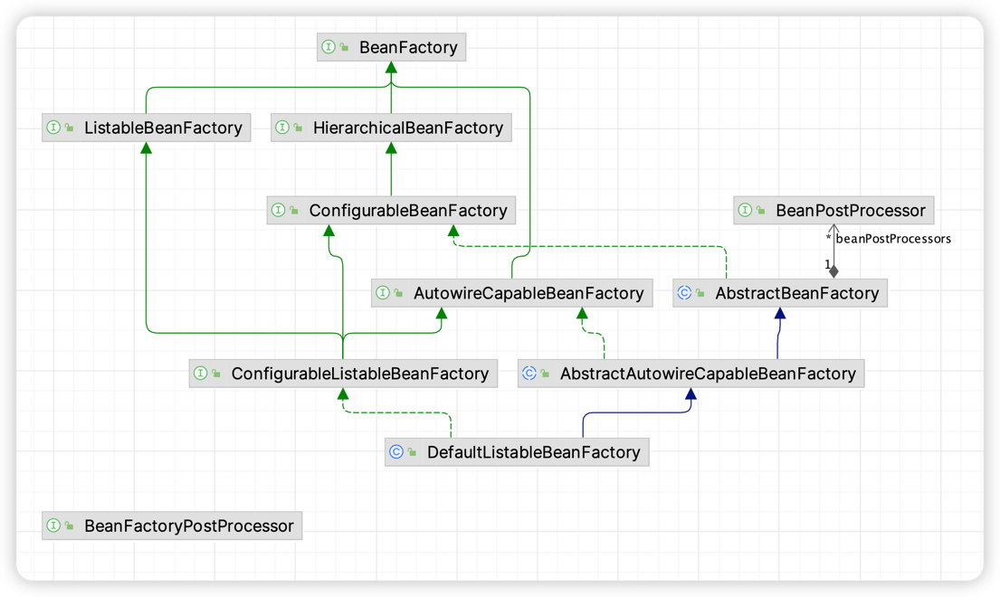
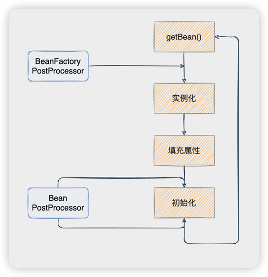

# Bean容器扩展机制

> 当前文档对应Git分支：`06-bean-processor`

针对BeanFactory实例化、初始化Bean的时候，增加一系列的前置后置处理器，从而影响Bean的实例化、初始化结果；

这里称这种影响Bean容器内容的处理器成为Bean容器的扩展机制。

这里就介绍两种扩展机制：

1. `BeanPostProcessor`：Bean初始化前后的处理器，在Bean实例化后，影响初始化的内容（例如改变Bean中的属性值）
2. `BeanFactoryPostProcessor`：Bean实例化前，影响Bean实例化结果（例如改变BeanDefinition内容）



在之前的版本中我们知道了，BeanFactory是委托给AbstractBeanFactory完成Bean创建，而实际上最终是由AbstractAutowireCapableBeanFactory
完成的Bean实例化、属性填充、初始化等操作的；

如上图，我们在此基础上新增了几个接口：

## 接口介绍

1. `ListableBeanFactory`：用于获取Bean实例信息
2. `HierarchicalBeanFactory`：作为BeanFactory接口的扩展接口供子类调用

如上，上面两个接口可以暂且认为是BeanFactory接口的一种扩展实现入口，其他的子类仅实现此接口即可。

下面是一些扩展处理器的核心接口：

1. `ConfigurationBeanFactory`：作为BeanFactory扩展机制的基类接口
2. `ConfigurationListableBeanFactory`：ConfigurationBeanFactory的扩展实现接口
3. `BeanPostProcessor`：Bean初始化前后的处理器，在Bean实例化后，影响初始化的内容
4. `BeanFactoryPostProcessor`：Bean实例化前，影响Bean实例化结果
5. `AutowireCapableBeanFactory`：作为BeanPostProcessor的入口接口，定义Processor具体操作



## ListableBeanFactory&HierarchicalBeanFactory

```java
public interface HierarchicalBeanFactory extends BeanFactory {
}

public interface ListableBeanFactory extends BeanFactory {

}
```

## ConfigurationBeanFactory

```java
public interface ConfigurableBeanFactory extends HierarchicalBeanFactory, SingletonBeanRegistry {

    /**
     * 添加Bean初始化处理器
     *
     * @param beanPostProcessor Bean初始化处理器
     */
    void addBeanPostProcess(BeanPostProcessor beanPostProcessor);
}
```

## ConfigurationListableBeanFactory

```java
public interface ConfigurableListableBeanFactory extends ListableBeanFactory, AutowireCapableBeanFactory, ConfigurableBeanFactory {

    /**
     * 根据Bean名称在BeanDefinition容器中匹配
     *
     * @param beanName Bean名称
     * @return BeanDefinition对象
     * @throws BeansException
     */
    BeanDefinition getBeanDefinition(String beanName) throws BeansException;

}
```

## BeanPostProcessor

```java
public interface BeanPostProcessor {

    /**
     * Bean初始化之前执行
     *
     * @param bean     Bean实例
     * @param beanName Bean名称
     * @return 处理后的Bean实例
     * @throws BeansException
     */
    Object postProcessBeforeInitialization(Object bean, String beanName) throws BeansException;

    /**
     * Bean初始化之后执行
     *
     * @param bean     Bean实例
     * @param beanName Bean名称
     * @return 处理后的Bean实例
     * @throws BeansException
     */
    Object postProcessAfterInitialization(Object bean, String beanName) throws BeansException;
}
```

## BeanFactoryPostProcessor

```java
public interface BeanFactoryPostProcessor {

    /**
     * Bean实例化前的处理器
     *
     * @param beanFactory 工厂对象
     * @throws BeansException
     */
    void postProcessorBeanFactory(ConfigurableListableBeanFactory beanFactory) throws BeansException;
}
```

## AutowireCapableBeanFactory

```java
public interface AutowireCapableBeanFactory extends BeanFactory {

    /**
     * 用于执行BeanPostProcess的postProcessBeforeInitialization方法
     *
     * @param existingBean 已存在的Bean实例
     * @param beanName     bean名称
     * @return 处理后的Bean实例
     * @throws BeansException
     */
    Object applyBeanPostProcessorsBeforeInitialization(Object existingBean, String beanName) throws BeansException;

    /**
     * 用于执行BeanPostProcess的postProcessAfterInitialization方法
     *
     * @param existingBean 已存在的Bean实例
     * @param beanName     bean名称
     * @return 处理后的Bean实例
     * @throws BeansException
     */
    Object applyBeanPostProcessorsAfterInitialization(Object existingBean, String beanName) throws BeansException;
}
```

## 测试

```java
public class CustomBeanFactoryPostProcessor implements BeanFactoryPostProcessor {

    @Override
    public void postProcessorBeanFactory(ConfigurableListableBeanFactory beanFactory) throws BeansException {
        System.out.println("这是【BeanFactoryPostProcessor】自定义后置处理器，作用与Bean实例化前");

        // Bean实例化前修改BeanDefinition内容
        BeanDefinition beanDefinition = beanFactory.getBeanDefinition("hello");
        MutablePropertyValues propertyValues = beanDefinition.getPropertyValues();
        // 修改/覆盖属性值
        propertyValues.addPropertyValue(new PropertyValue("des", "这是前置处理器增加的"));

    }
}

public class CustomBeanPostProcessor implements BeanPostProcessor {

    @Override
    public Object postProcessBeforeInitialization(Object bean, String beanName) throws BeansException {
        System.out.println("这是【BeanPostProcessor】自定义前置处理器，作用与Bean初始化前");

        return null;
    }

    @Override
    public Object postProcessAfterInitialization(Object bean, String beanName) throws BeansException {
        System.out.println("这是【BeanPostProcessor】自定义后置处理器，作用与Bean初始化后");

        return null;
    }
}

public class BeanProcessorTest {

    @Test
    public void t1() {
        DefaultListableBeanFactory beanFactory = new DefaultListableBeanFactory();
        BeanDefinitionReader reader = new XmlBeanDefinitionReader(beanFactory);
        reader.loadBeanDefinitions("classpath:spring-bean-definition.xml");

        // BeanDefinition加载后，使用BeanFactoryProcessor，在Bean实例化前影响BeanDefinition结果
        CustomBeanFactoryPostProcessor beanFactoryPostProcessor = new CustomBeanFactoryPostProcessor();
        beanFactoryPostProcessor.postProcessorBeanFactory(beanFactory);

        Object hello = beanFactory.getBean("hello");
        System.out.println(hello);
    }

    @Test
    public void t2() {
        DefaultListableBeanFactory beanFactory = new DefaultListableBeanFactory();
        BeanDefinitionReader reader = new XmlBeanDefinitionReader(beanFactory);
        reader.loadBeanDefinitions("classpath:spring-bean-definition.xml");

        // BeanDefinition加载后，添加Bean实例化后的处理器，作用与Bean初始化前或者初始化后
        CustomBeanPostProcessor beanPostProcessor = new CustomBeanPostProcessor();
        beanFactory.addBeanPostProcess(beanPostProcessor);

        Object hello = beanFactory.getBean("hello");
        System.out.println(hello);
    }
}
```

## 总结

通过上面的代码我们可以简单概括下：

> XxPostProcessor是干什么的？

我们介绍了BeanPostProcessor和BeanFactoryPostProcessor，都是针对Bean和BeanFactory的处理器，因为BeanFactory的维度更高，
所以BeanFactoryProcessor在在实例化前执行的。

本质上，这都是Bean的扩展机制，目的都是为了影响Bean实例化、初始化结果，从而更加动态的控制Bean容器内容，实现代码解耦。

> BeanPostProcessor如何影响Bean初始化前后结果呢？

通过上述代码，可以看到我们只需要在`AbstractAutowireCapableBeanFactory`中，当Bean实例化之后，
在执行初始化代码前后调用BeanProcessor的前置和后置处理器即可。

> BeanFactoryPostProcessor如何影响Bean实例化的结果呢？

同样的逻辑，只需要在BeanDefinition初始化之后，Bean实例化前去动态改变BeanDefinition内容即可影响Bean实例化结果