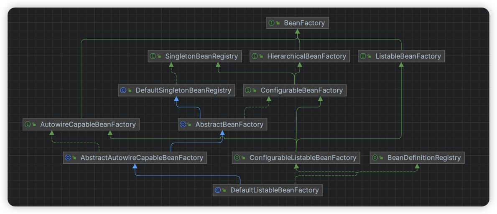
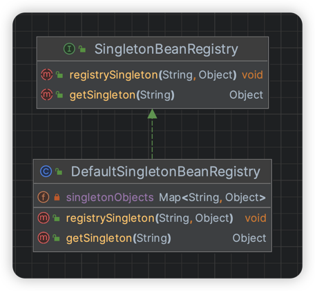
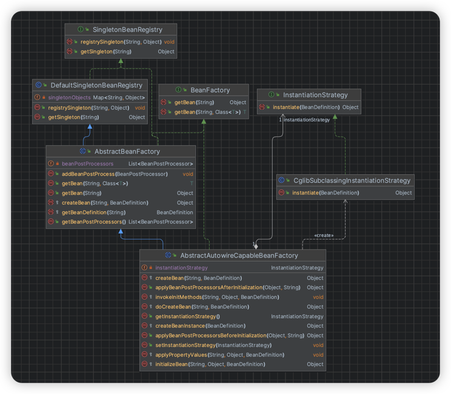
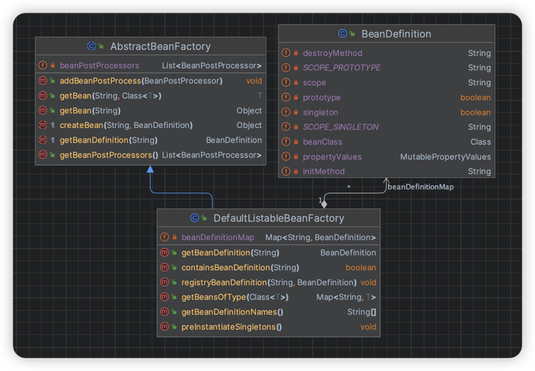
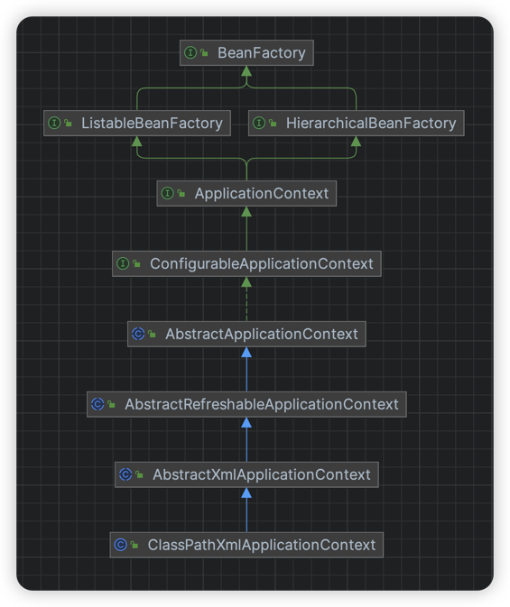

# Spring应用上下文

> 当前文档对应Git分支：`07-application-context`

## 前言

在介绍ApplicationContext应用上下文前，我们先整体回顾Bean的创建流程：



### BeanMap容器在哪维护？

存放Bean对象的容器是Map容器，其中：

1. BeanMap容器管理接口：`SingletonBeanRegistry`
2. BeanMap容器接口默认实现：`DefaultSingletonBeanRegistry`



可以看到通过调用`SingletonBeanRegistry`接口完成向Bean容器注册Bean对象。

### Bean如何创建？



> 创建Bean的入口在哪里？

答：`BeanFactory`

我们知道BeanFactory是Bean工厂对象，其中最核心的方法就是`getBean()`，这就是Bean创建的入口方法。

> Bean工厂如何实现getBean？

答：`AbstractBeanFactory`

`AbstractBeanFactory`是BeanFactory的抽象实现类，当调用getBean实例化Bean时：
1. 先从`DefaultSingletonBeanRegistry`看能否拿到Bean实例，如果拿到就直接返回
2. 如果拿不到就调用抽象方法`createBean()`

> Bean工厂如何createBean？

答：`AbstractAutowireCapableBeanFactory`

可以看到`AbstractAutowireCapableBeanFactory`才是负责最终创建Bean实例操作，在这里会根据Bean实例化策略用对应的实例化策略去实例化Bean

> Bean实例化方式（策略）？

答：`CglibSubclassingInstantiationStrategy`

Spring实例化Bean使用了Cglib。

我们知道对象创建使用`class.newInstance()`即可，这是用到了构造方法实例化；
这种方式并不是不可以实现，但是Spring后续还要完成AOP切入（拦截器）实现，那么用构造方法实例化就不妥了；

于是出现代理模式，由代理类去调用具体的实例化操作，通过也满足后续使用AOP切入的实现；

但是因为我们不能实例化一个类就创建一个代理类，因此出现动态代理的概念；顾名思义，代理类在Bean创建时动态生成（无需手动维护）

> 什么时候注册Bean？

答：`CglibSubclassingInstantiationStrategy`

也就是Bean一旦实例化后，就立即调用`SingletonBeanRegistry`接口注册Bean；
下次再getBean时就直接从`SingletonBeanRegistry`BeanMap容器中获取单例Bean，无需再实例化；

> Bean实例化需要的信息在哪定义？

答：`BeanDefinition`

想要实例化Bean，我们需要一些必要参数支撑，比如：Bean名称、是否单例、Class对象、实例化策略等等...

这些数据都定义在BeanDefinition对象中

> BeanDefinition在哪维护？

答：`DefaultListableBeanFactory`



和BeanMap容器一样，同样有一个BeanDefinitionMap容器管理Bean的实例化信息；

`DefaultListableBeanFactory`可以认为是核心，也就是为什么最上面图中展示的所有接口的基类都是`DefaultListableBeanFactory`

`DefaultListableBeanFactory`继承了BeanFactory的所有功能，并且提供对BeanDefinition实例化信息的维护

> Bean在哪定义实例化

到目前位置，我们提供了从XML资源文件中拿到BeanDefinition定义信息，也就是我们熟知的`<bean></bean>`标签。

## ApplicationContext

上面详细回顾了Bean创建的流程，但是上述都只是围绕Bean的创建也就是BeanFactory的实现，
BeanFactory只是提供了一个getBean的入口（我们可以称这种方式是懒加载，也就是只有显示调用getBean时才进行实例化）；

因此Spring需要一个全局的控制，控制Bean在什么时候实例化，以及Bean实例化、初始化前后的PostProcessor扩展器如何加载等等的操作；
这些操作就定义在ApplicationContext，我们将这种**由Spring将对象注册到Bean容器**的一系列操作成为Spring应用上下文。



可以看到ApplicationContext继承了ListableBeanFactory接口的所有功能，并且提供更强大的实现。

### ConfigurableApplicationContext

ConfigurableApplicationContext作为ApplicationContext配置的一个父类接口，核心提供了我们面试常问的`refresh()`方法：

```java
public interface ApplicationContext extends ListableBeanFactory, HierarchicalBeanFactory, ResourceLoader {
}

public interface ConfigurableApplicationContext extends ApplicationContext {

    /**
     * 加载或刷新容器
     *
     * @throws BeansException
     */
    void refresh() throws BeansException;
}
```

### AbstractApplicationContext

ApplicationContext的抽象实现类

```java
public abstract class AbstractApplicationContext extends DefaultResourceLoader implements ConfigurableApplicationContext {

    @Override
    public void refresh() throws BeansException {
        // 创建BeanFactory并初始化BeanDefinition
        refreshBeanFactory();
        ConfigurableListableBeanFactory beanFactory = getBeanFactory();

        // 实例化Bean之前先加载BeanFactoryPostProcessor处理器
        invokeBeanFactoryPostProcessors(beanFactory);

        // BeanPostProcessor要在其他Bean实例化之前注册
        registerBeanPostProcessors(beanFactory);

        // 提前实例化单例Bean
        beanFactory.preInstantiateSingletons();
    }

    /**
     * 创建BeanFactory，并加载BeanDefinition
     *
     * @throws BeansException
     */
    protected abstract void refreshBeanFactory() throws BeansException;

    public abstract ConfigurableListableBeanFactory getBeanFactory();

    protected void invokeBeanFactoryPostProcessors(ConfigurableListableBeanFactory beanFactory) {
        Map<String, BeanFactoryPostProcessor> beanFactoryPostProcessorMap = beanFactory.getBeansOfType(BeanFactoryPostProcessor.class);
        for (BeanFactoryPostProcessor processor : beanFactoryPostProcessorMap.values()) {
            processor.postProcessorBeanFactory(beanFactory);
        }
    }

    /**
     * 预先注册BeanPostProcessor对象
     *
     * @param beanFactory 工厂类
     */
    protected void registerBeanPostProcessors(ConfigurableListableBeanFactory beanFactory) {
        Map<String, BeanPostProcessor> beanFactoryPostProcessorMap = beanFactory.getBeansOfType(BeanPostProcessor.class);
        for (BeanPostProcessor processor : beanFactoryPostProcessorMap.values()) {
            beanFactory.addBeanPostProcess(processor);
        }
    }

    @Override
    public Object getBean(String beanName) throws BeansException {
        return getBeanFactory().getBean(beanName);
    }

    @Override
    public <T> T getBean(String beanName, Class<T> requiredType) throws BeansException {
        return getBeanFactory().getBean(beanName, requiredType);
    }

    @Override
    public <T> Map<String, T> getBeansOfType(Class<T> type) throws BeansException {
        return getBeanFactory().getBeansOfType(type);
    }

    @Override
    public String[] getBeanDefinitionNames() {
        return getBeanFactory().getBeanDefinitionNames();
    }
}
```

从`refresh()`方法的实现中我们知道他的核心功能：

1. 创建BeanFactory工厂类，同时加载BeanDefinition
2. 预先加载BeanFactoryPostProcessor处理器（加载的核心思路是从BeanMap中拿到BeanFactoryPostProcessor接口的子类然后执行）（影响实例化结果）
3. 再加载BeanPostProcessor（在Bean实例化之前注册，当Bean初始化前后会调用前置和后置处理器）（影响Bean初始化结果）
4. 提前初始化所有Bean

### AbstractRefreshableApplicationContext

AbstractRefreshableApplicationContext完成BeanFactory创建和BeanDefinition加载

```java
public abstract class AbstractRefreshableApplicationContext extends AbstractApplicationContext {

    private DefaultListableBeanFactory beanFactory;

    @Override
    protected final void refreshBeanFactory() throws BeansException {
        DefaultListableBeanFactory beanFactory = createBeanFactory();
        loadBeanDefinitions(beanFactory);
        this.beanFactory = beanFactory;
    }

    /**
     * 创建BeanFactory
     *
     * @return 实例对象
     */
    protected DefaultListableBeanFactory createBeanFactory() {
        return new DefaultListableBeanFactory();
    }

    /**
     * 加载BeanDefinition
     *
     * @param beanFactory BeanDefinition容器工厂
     * @throws BeansException
     */
    protected abstract void loadBeanDefinitions(DefaultListableBeanFactory beanFactory) throws BeansException;

    @Override
    public ConfigurableListableBeanFactory getBeanFactory() {
        return beanFactory;
    }
}
```

AbstractXmlApplicationContext

```java
public abstract class AbstractXmlApplicationContext extends AbstractRefreshableApplicationContext {

    @Override
    protected void loadBeanDefinitions(DefaultListableBeanFactory beanFactory) throws BeansException {
        XmlBeanDefinitionReader reader = new XmlBeanDefinitionReader(beanFactory, this);
        String[] locations = getConfigLocations();
        if (locations != null) {
            reader.loadBeanDefinitions(locations);
        }
    }

    /**
     * 获取XML配置文件位置
     *
     * @return 集合
     */
    protected abstract String[] getConfigLocations();
}
```

ClassPathXmlApplicationContext

```java
public class ClassPathXmlApplicationContext extends AbstractXmlApplicationContext {

    private String[] configLocations;

    public ClassPathXmlApplicationContext(String configLocation) throws BeansException {
        this(new String[]{configLocation});
    }

    /**
     * 从配置文件加载BeanDefinition并刷新应用上下文
     *
     * @param configLocations 配置文件地址
     * @throws BeansException
     */
    public ClassPathXmlApplicationContext(String[] configLocations) throws BeansException {
        this.configLocations = configLocations;
        refresh();
    }

    @Override
    protected String[] getConfigLocations() {
        return this.configLocations;
    }

}
```

## 总结

ApplicationContext应用上下文管理了Bean全局的维护（创建、销毁等），以及PostProcessor处理器的管理等等操作；

ApplicationContext继承了BeanFactory的所有功能，并且提前完成Bean的创建操作，因此Spring会在启动时就将所有Bean加载到应用上下文容器中