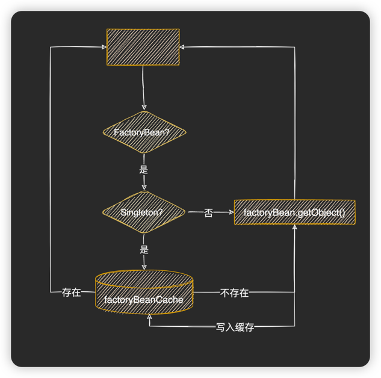
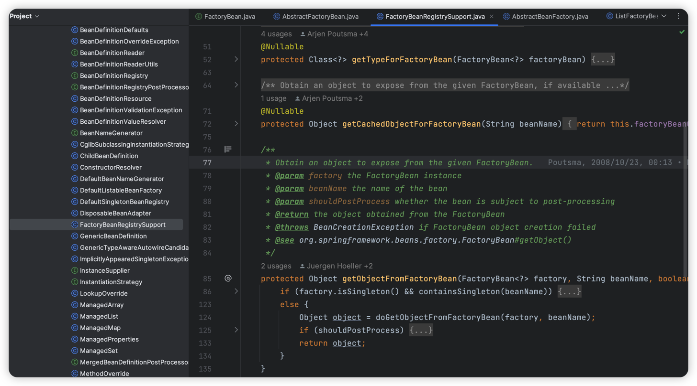
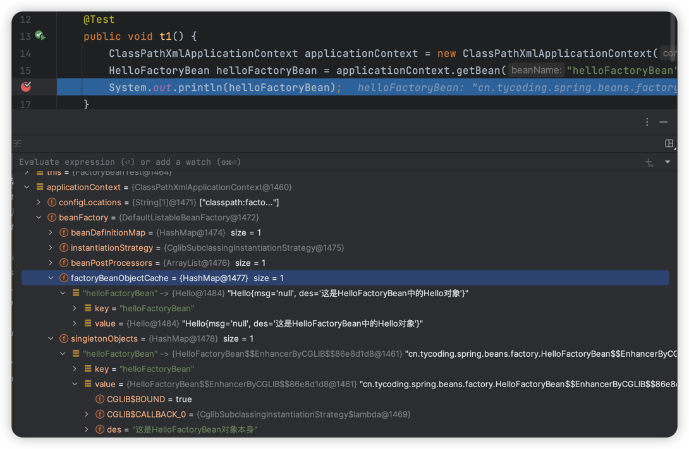

# FactoryBean接口

> 当前文档对应Git分支：`11-factory-bean`

在面试的时候我们经常被问到，FactoryBean和BeanFactory的区别是什么？

## 前言

> Spring中有几种Bean？

可以认为，Spring中有两种Bean：
1. 普通Bean：由BeanFactory的getBean()生成实例对象，此时生成的是该对象本身。
2. 工厂Bean：由FactoryBean接口实现，他拥有BeanFactory的功能生成该对象本身实例；**其次，它还可以通过getObject()生成其他实例对象**

> BeanFactory

学习了前面的章节后我们知道：**BeanFactory是Bean工厂类，用于生产Bean实例对象，核心方法是getBean()**；

对于普通Bean：

- 如果是singleton模式，将写入到`singletonObjects`容器中，并由`DefaultSingletonBeanRegistry`对象维护Bean容器；
- 如果是prototype模式，则直接返回实例对象，不再写入`singletonObjects`容器；

> FactoryBean

1. 首先他是一种Bean，会经过上面的BeanFactory处理，（如果是singleton模式）写入到`singletonObjects`容器
2. 其次他能生产Bean，FactoryBean的`getObject()`会返回他要生产的Bean实例对象，并将此实例写入到单独的`factoryBeanObjectCache`容器

## FactoryBean

上面已经介绍了，FactoryBean是一种特殊的Bean，他拥有普通Bean的全部功能，额外拥有对getObject()方法的单独处理；

那么如何实现这种功能呢？核心代码如下：

```java
public interface FactoryBean<T> {

    /**
     * FactoryBean 生产的Bean
     *
     * @return 返回生产的Bean实例，而不是FactoryBean本身
     */
    T getObject() throws Exception;

    boolean isSingleton();
}

public class FactoryBeanRegistrySupport extends DefaultSingletonBeanRegistry {

    private final Map<String, Object> factoryBeanObjectCache = new HashMap<>();

    /**
     * 如果Bean是FactoryBean，则返回getObject创建的Bean
     */
    protected Object getObjectFromFactoryBean(Object beanInstance, String beanName) {
        Object bean = beanInstance;
        if (bean instanceof FactoryBean) {
            FactoryBean factoryBean = (FactoryBean) bean;
            try {
                if (factoryBean.isSingleton()) {
                    // singleton模式，从缓存获取
                    Object obj = this.factoryBeanObjectCache.get(beanName);
                    if (obj == null) {
                        bean = factoryBean.getObject();
                        this.factoryBeanObjectCache.put(beanName, bean);
                    }
                } else {
                    // prototype模式，创建新的实例
                    bean = factoryBean.getObject();
                }
            } catch (Exception e) {
                throw new BeansException("FactoryBean throw exception on object [" + beanName + "] creation", e);
            }
        }
        return bean;
    }
}
```



可以看到FactoryBean的核心逻辑处理是对当前FactoryBean的`getObject()`方法返回对象做单独的缓存处理（`factoryBeanObjectCache`），
而FactorBean对象本身仍作为普通Bean返回并最后放入`singletonObjects`容器中。

在Spring源码中我们能看到大概的处理逻辑：



## AbstractBeanFactory

定义了上述处理FactoryBean的逻辑，还要融合进入BeanFactory的`getBean()`方法逻辑中：

```java
public abstract class AbstractBeanFactory extends FactoryBeanRegistrySupport implements ConfigurableBeanFactory {

    @Override
    public Object getBean(String beanName) throws BeansException {
        Object sharedInstance = getSingleton(beanName);
        if (sharedInstance != null) {
            // 判断是否是FactoryBean
            return getObjectFromFactoryBean(sharedInstance, beanName);
        }
        BeanDefinition beanDefinition = getBeanDefinition(beanName);
        Object bean = createBean(beanName, beanDefinition);
        return getObjectFromFactoryBean(bean, beanName);
    }
    
    ...
}
```

## 测试

```java
public class HelloFactoryBean implements FactoryBean<Hello> {

   private String des;

    @Override
    public Hello getObject() throws Exception {
        Hello hello = new Hello();
        hello.setDes("这是HelloFactoryBean中的Hello对象");
        return hello;
    }

    @Override
    public boolean isSingleton() {
        return true;
    }

    public String getDes() {
        return des;
    }

    public void setDes(String des) {
        this.des = des;
    }
}

public class FactoryBeanTest {

    @Test
    public void t1() {
        ClassPathXmlApplicationContext applicationContext = new ClassPathXmlApplicationContext("classpath:factory-bean.xml");
        HelloFactoryBean helloFactoryBean = applicationContext.getBean("helloFactoryBean", HelloFactoryBean.class);
        System.out.println(helloFactoryBean);
    }
}
```

通过Debug可以看当前：
1. `singletonObjects`：保存了`HelloFactoryBean`对象本身
2. `factoryBeanObjectCache`：保存了`getObject()`方法的对象`Hello`



