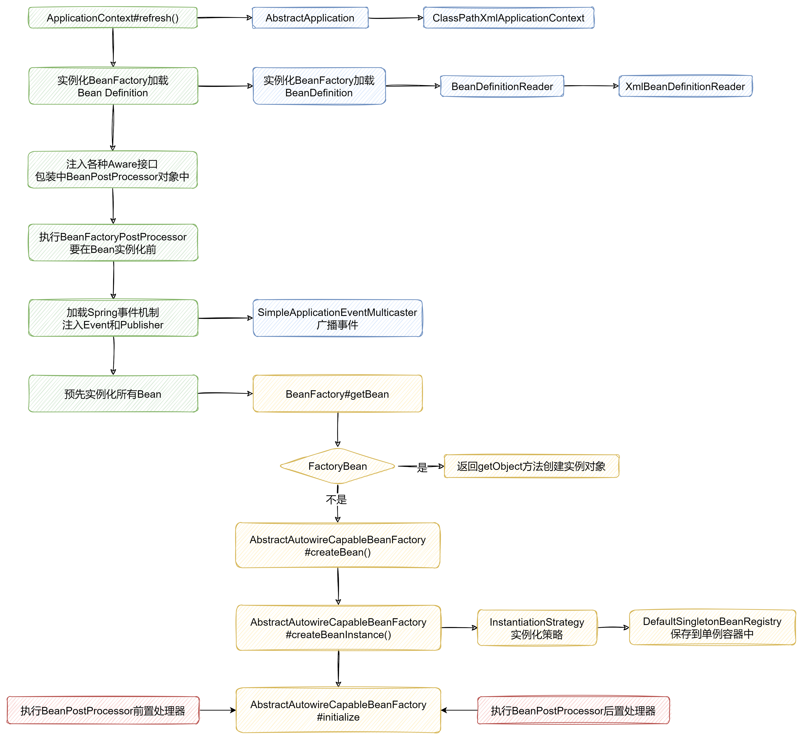

# IOC

> Tips

阅读本篇文档之前，默认读者已经学习了之前 [1-12] 章节的内容并完成的相应的编码；本篇文档主要对前12章节的内容总结，围绕IOC核心思想整体分析编码的实现逻辑。

## 引入

IOC全称是 Inversion of Control，即 **控制反转**；IOC强调的是一种思想，即将设计好的对象交由IOC容器管理，而不是使用者自己维护对象。
IOC强调了两个概念：

> **1. 谁控制谁？**

我们知道Java是面向对象的，而通常用`new`关键字创建对象，但会想这种由程序主动创建依赖对象的耦合度很高；
因此需要一个统一的容器去管理这些依赖对象，在想要的时候直接从容器中拿；
此时**容器负责了依赖对象的创建和销毁的操作**。

**控制**的概念就体现在：**依赖对象本来由程序主动创建而交由IOC容器统一创建和维护**，即对象的创建和维护权交给了IOC容器控制。

> **2. 反转了什么？**

结合前面的概念，正常程序获取一个对象是要先主动创建再拿到；而使用了IOC容器统一管理依赖对象后，就可以在程序任意位置直接从容器中拿到对象。

**反转**的概念就体现在：**依赖对象的获取方式反转了；由程序主动创建再获取变成了容器主动加载依赖对象程序被动去接收创建好的对象**。

## Why IOC

经过上面描述，我们知道IOC思想在Spring框架的主要体现是：**管理Bean的IOC容器**；

在Spring官网中我找到了这段描述：[https://docs.spring.io/spring-framework/docs/3.2.x/spring-framework-reference/html/beans.html](https://docs.spring.io/spring-framework/docs/3.2.x/spring-framework-reference/html/beans.html)

总结一下上面的描述，Spring的IOC容器有那些特点：

1. `beans`和`context`包是IOC的基础，`beans`包的核心是BeanFactory接口，`context`包的核心是ApplicationContext接口；
2. ApplicationContext接口继承自BeanFactory接口，也就是ApplicationContext具有BeanFactory接口的全部功能；
3. BeanFactory提供了配置框架和基础功能，ApplicationContext接口则增加了更多企业定制的功能；
4. 描述Bean元数据配置通过XML、Java注解、Java代码表示；XML配置例如`<bean>`标签、Java注解例如`@Autowire`注解；
5. ApplicationContext是Spring的应用上下文，他提供了Spring开箱即用的几个接口实现，核心是`refresh`接口；
6. XML文件是定义配置元数据的传统格式，因此截至目前的代码中我们仍是通过创建ClassPathXmlApplicationContext实例对象来加载ApplicationContext；

接着我们再描述一下在ApplicationContext层面，Bean加载的大概流程：

1. ApplicationContext作为入口，Spring启动时便会通过`refresh()`方法作为入口预先装配所有Bean实例；
2. 接着通过XML、注解、代码等方式配置Bean元数据信息以及依赖关系；
3. BeanFactory负责Bean的具体实例化，默认通过Cglib动态代理生成Bean实例；单例Bean最终被放在单例Map容器中；
4. ApplicationContext在BeanFactory实例化、初始化前后会加载各种Aware和BeanPostProcessor处理器以此影响Bean实例化、初始化结果；
5. ApplicationContext除了负责Bean的写入也负责后期Bean的销毁；
6. Spring通过事件机制维护整个上下文容器启动、刷新、关系等阶段的事件通知；

## 回顾

首先我们先看下截止目前为止，接口类间的关联关系：

接着，从BeanFactory接口维度描述下Bean的加载流程：

1. 通过Resource接口解析XML文件、注解等方式拿到Bean实例信息以及依赖关系；
2. 通过InstantiationStrategy接口拿到Bean实例化策略，Spring默认采用Cglib动态代理策略生成Bean实例；
3. 通过BeanDefinitionReader接口封装Bean实例化所需的BeanDefinition对象；
4. 进行Bean的实例化，实例化后的单例Bean会被放入singletonMap容器中；（1-3）
5. 注入BeanFactoryPostProcessor，作用与Bean实例化前，可以动态改变BeanDefinition结果，以此影响Bean实例化
6. 进行Bean的初始化，初始化过程包括对全局Bean实例化后的配置检查等；
7. 注入BeanPostProcessor，作用与Bean初始化前后，可以动态改变Bean的初始化信息；
8. 完成Bean的实例化、初始化（此时Bean的加载流程已经结束）

然后再从ApplicationContext上下文的层面分析整个启动流程：

1. 实例化BeanFactory对象并加载所有BeanDefinition信息；
2. 注入各种BeanPostProcessor对象，并在Bean实例化前和初始化前后过程中影响实例化和初始化结果
3. 在注入BeanPostProcessor的同时注入各种Aware接口，使得Spring容器能感知到外部需要获取的容器对象；
4. 注入Spring的事件机制，保证在ApplicationContext的初始化、刷新、关闭时监听到事件变化；
5. 以上对象加载完毕后最后再进行Bean的实例化，进行上面的Bean加载流程；

最后，通过简单的流程图描述下上述流程：

